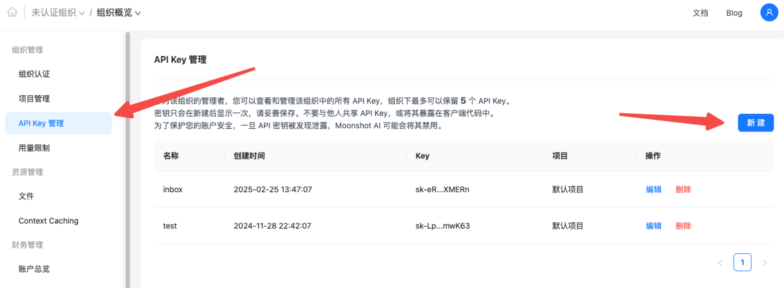
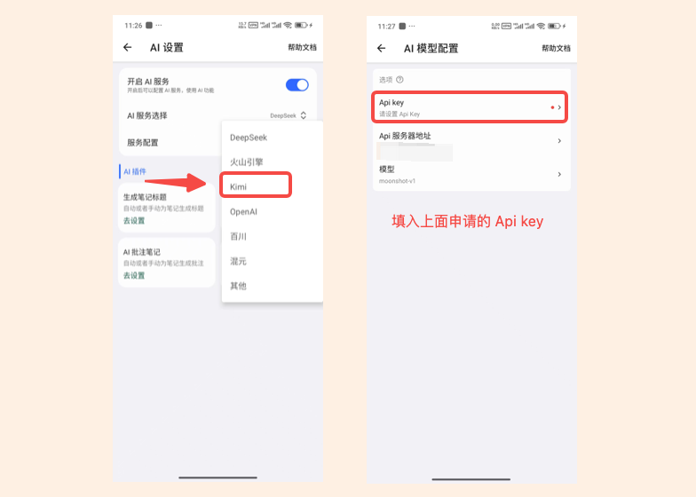
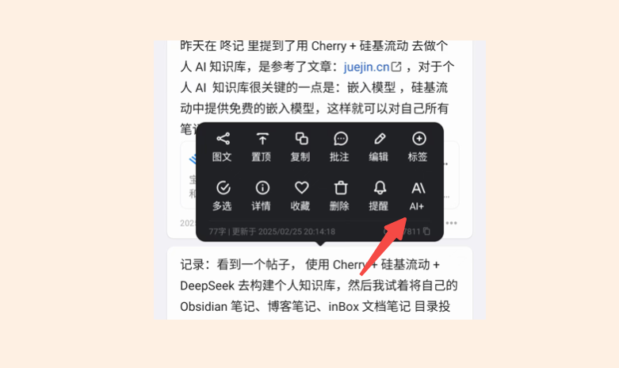

# 配置 Kimi 服务
inBox 在 1.8.4 版本中支持了 AI 能力，现在你可以通过 AI 服务来完成一些操作，比如：
- 生成文章标题
- 生成笔记批注
- 自动为笔记生成标签

那如何在 inBox 中使用 AI 服务呢？ 

## 如何配置 Kimi 服务
- 1. 首先，你需要在 Kimi 的用户中心（[点击访问](https://platform.moonshot.cn/console/account)）中创建一个 API key，点击 `API Key 管理`，点击 `新建 Key`，然后输入 API key 的名称，选择项目后，点击 `确定`，就可以创建一个 API key，如下所示：

创建后，**立即复制 key 到粘贴板**，下一步就会用到。

- 2. 打开 inBox 笔记，点击主页左上角菜单后，点击设置按钮，点击 `AI`，然后在 AI 服务选择下选择 `Kimi`，选择后，点击去配置，在下一个页面中，打开 API key，填入上面申请的 Api Key，服务器地址和模型 inBox 已经帮你填好了，一般情况下不用修改，这样就配置好了 Kimi 服务。

- 3. 配置完成后，来到笔记主页，选择一个笔记，点击笔记卡片右下角的菜单，点击 `AI+` 就会弹出 AI 菜单，如下所以

通过以上操作就可以完成 Kimi 服务的配置。其他 AI 服务都是同样的原理，你可以在网上找一些教程进行配置。

## 其他
- [DeepSeek R1 火山引擎版本的 Api key 申请教程](https://www.bilibili.com/video/BV1LCN2eZEAX?buvid=XX2BD79264BA14F3DBC8FEB1491DE6EF91AD7&is_story_h5=false&mid=jJNWJZtDclb%2BrtUeIoW7ww%3D%3D&plat_id=114&share_from=ugc&share_medium=android&share_plat=android&share_session_id=8bfb1fe9-e581-45a8-a2f9-ec669ff2dfd2&share_source=WEIXIN&share_tag=s_i&timestamp=1740044646&unique_k=N2pFtPF&up_id=382006364)