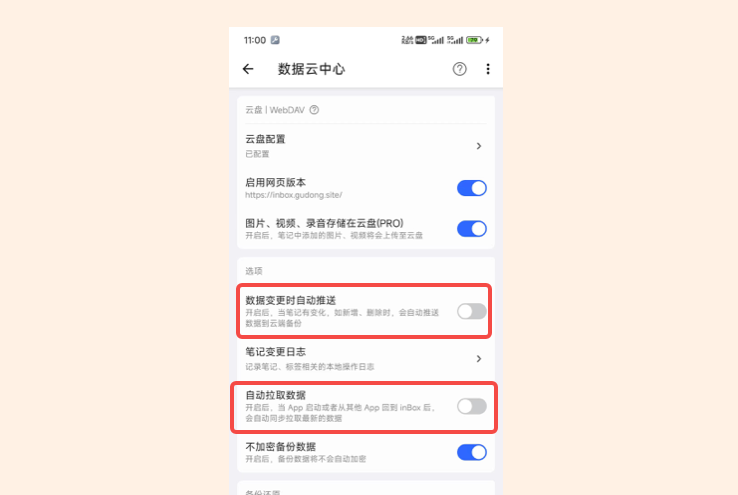
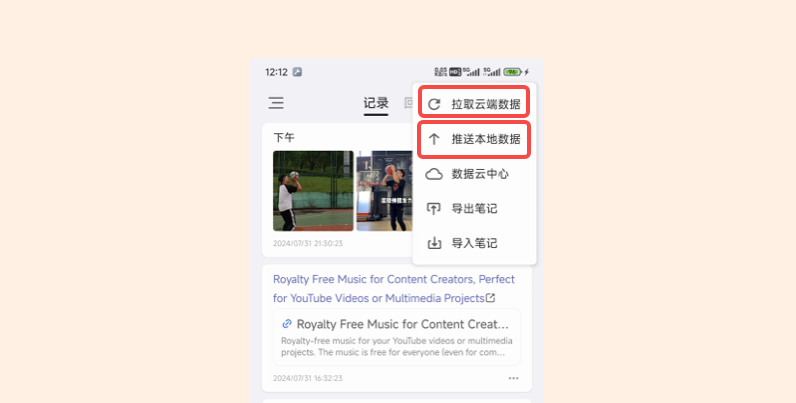

# 如何在网页端、客户端同步数据
因为网页版跟客户端使用同一份数据，如果同时在两边编辑会存储数据冲突，如果你的数据量小，建议你**开启自动拉取数据和自动推送数据**，这样每次数据变化时，数据都会第一时间推送到云端，打开 App 也会自动拉取一次最新的数据。

如果数据比较多，自动拉取会浪费一部分流量，所以对于数据量大的同学，建议可以手动去拉取和推送数据。

## 手动控制

在手机端写笔记时，首先拉取一次最新的数据，然后记笔记，记完后，再手动推送数据，这样就可以让远端数据保持最新。如果平时不用网页版，则不需要这样操作

当在网页端发布完笔记，想要在手机上查看，那么就先手动拉取一次数据，既可获取到最新的网页端的改动。

