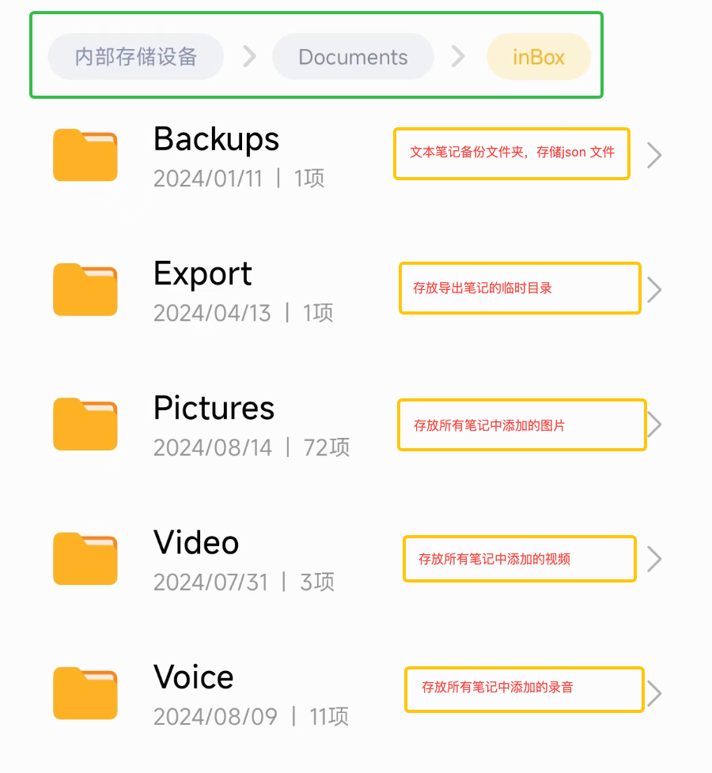
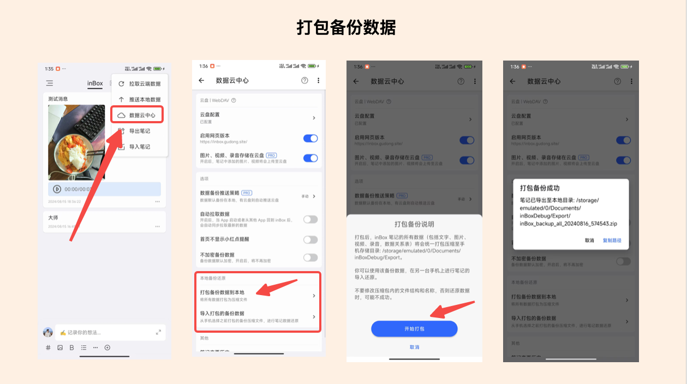
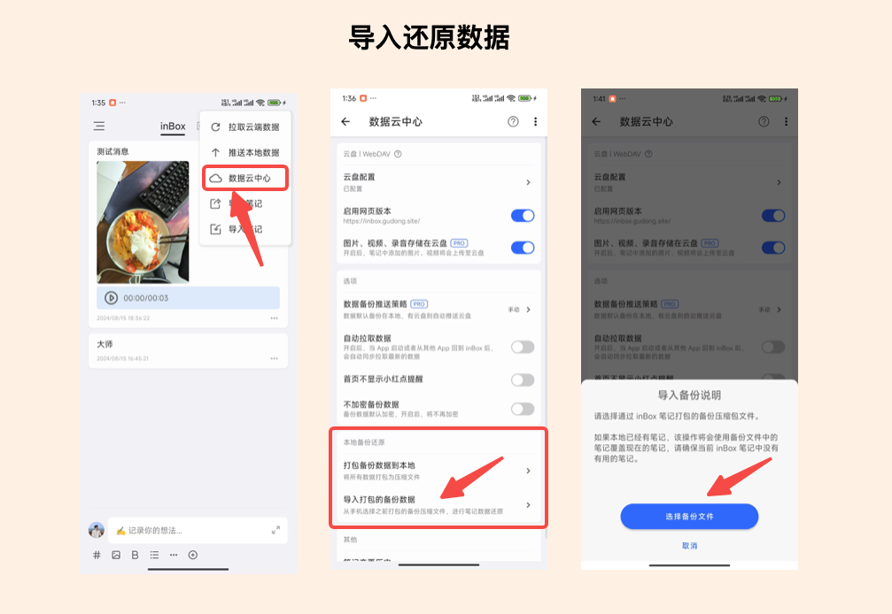

# 如何备份还原本地数据
inBox 笔记是一个本地笔记，笔记中的所有笔记的文本备份数据，以及笔记中用到的图片、视频等文件，均保存在本地文件夹：
> /storage/emulated/0/Documents/inBox

下图是文件夹具体介绍：

inBox 支持**将笔记文本数据和图片等附件打包为一个压缩包**，这样当更换手机时，只需要在 inBox 中完成备份文件的打包操作，就可以把 inBox 中所有的数据打包为一个文件。

然后在另一台手机上，安装 inBox 笔记，接着通过笔记恢复入口，导入之前的压缩文件，就可以完成 inBox 笔记数据从一台设备迁移到另一台设备，具体操作如下所示：

## 如何操作
从 inBox 笔记首页的右上角，打开数据云中心，然后找到本地备份还原模块，选择打包备份数据到本地，即可将数据打包至目录：
> /storage/emulated/0/Documents/inBox/Export 

在该目录下你可以找到压缩文件，然后通过微信、QQ、蓝牙等文件传输工具，将文件发送至其他手机进行保存，然后安装 inBox 笔记，同样的路径，找到文件导入入口，选择发送过来的文件，即可进行数据导入，完成数据恢复。

## 演示图

---

