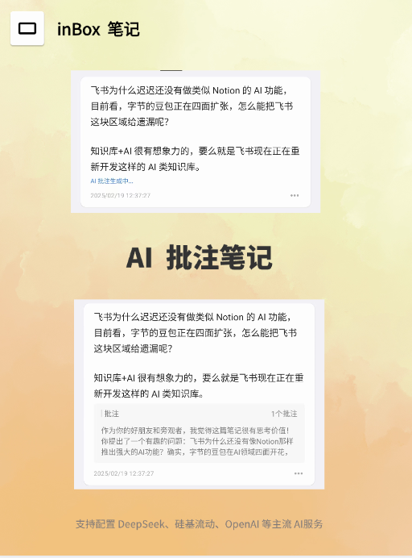

# AI 服务
inBox 最新版本中支持了添加用户自己的 AI 服务。这样 inBox 笔记就可以使用用户自定义 AI 服务去处理分析笔记。

## 配置
inBox 支持标准的 AI 请求配置，这里以配置 Kimi 为例，介绍如何在 inBox 中配置 Kimi 的 AI 的能力，具体可查看[inBox 中配置 Kimi](ai_kimi.md)

## AI 能力
目前 inBox 支持的 AI 能力有：
- 自动生成文章标题
- 自动生成笔记批注
- 自动为笔记生成标签

### 自动生成文章标题
该功能，也就是当你写完一篇笔记后，自动通过 AI 为笔记生成一个标题，不用自己去撰写。

### AI 自动批注
该功能，也就是当写完一篇笔记，自动通过 AI 为笔记生成一个批注，你还可以为 AI 设置具体的文字命令(PRO 功能)。

演示视频可查看这篇小红书笔记，[地址](http://xhslink.com/a/kBEaUEQjMO75)

### 自动为笔记生成标签
该功能，也就是当写完一篇笔记，自动通过 AI 为笔记生成标签。

---

说明：
- AI 能力均为三方能力，通过用户自己注册购买 AI 服务，inBox 作为本地笔记不提供任何 AI 服务。