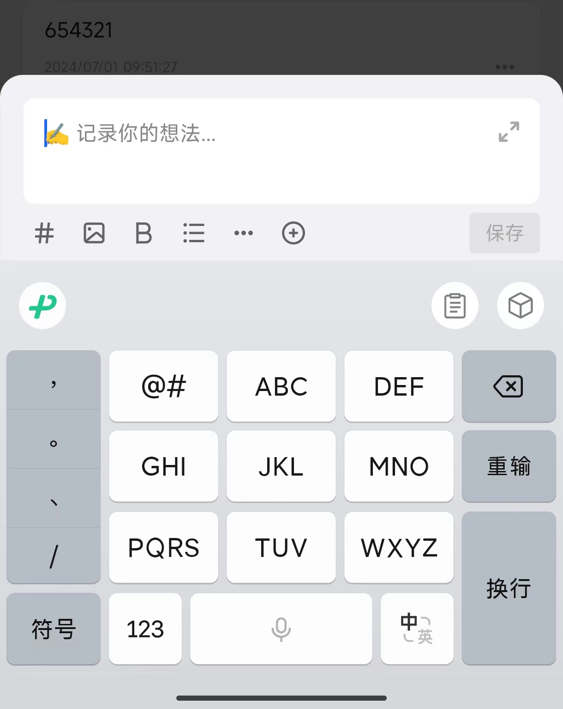
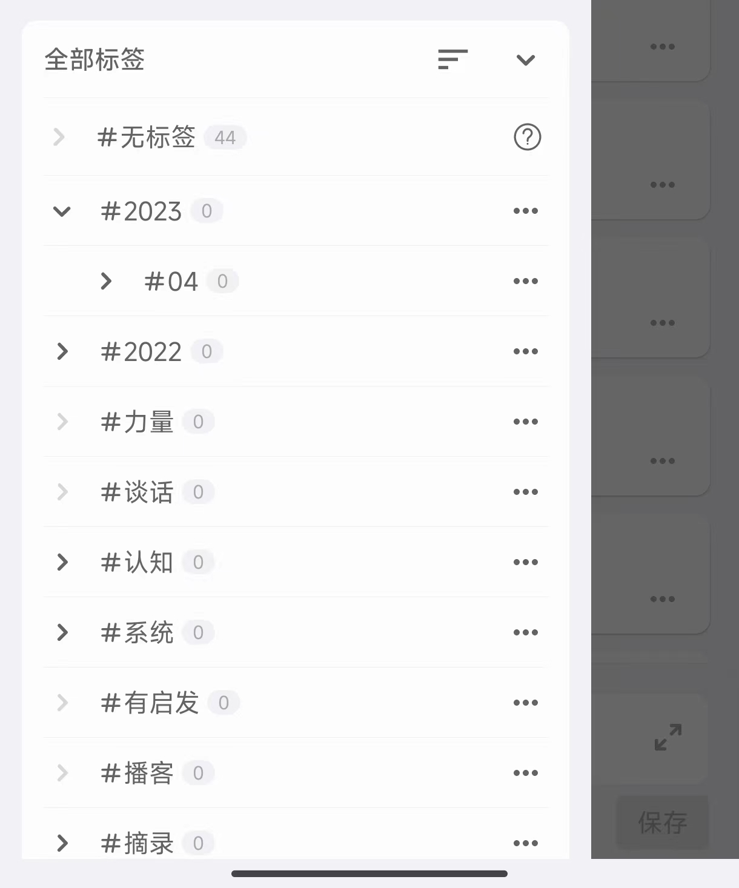
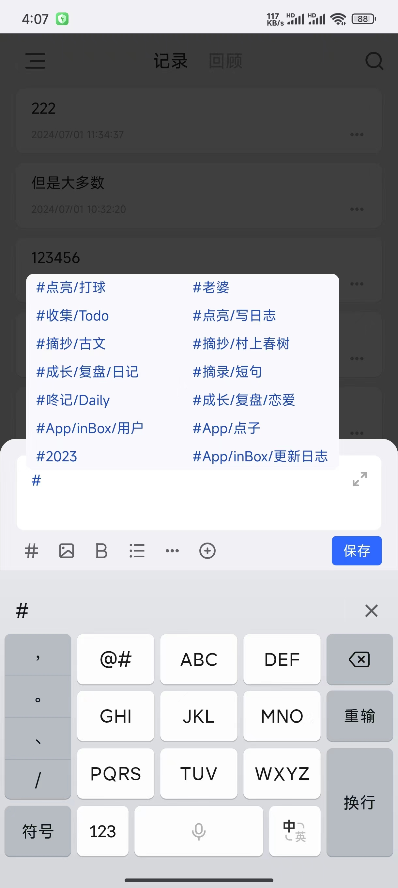

#  快速上手

inBox 笔记是一个本地优先的无压闪念笔记 App，帮大家记住一闪而过的灵感，跟其它 App 不一样，inBox 更注重于记录短小的卡片笔记，并使用了类似聊天窗口的交互，来降低大家的输入压力，使得我们可以像聊天一样记录，该想法最初来自 flomo。

下面来快速了解下如何使用 inBox 笔记来高效记录。

##  打开就写

打开 APP 后，不同于其他 APP，需要点击加号或者按钮才可以进行输入，在 inBox 中一步到位，页面底部就是**聊天式输入框**，这就像你打开了微信的聊天页面，点击输入框立即就可以投入文字的记录中。

##  用标签管理笔记

很多传统的笔记都使用分组去管理笔记，但是对于手机上的碎片化记录，分组管理会显得沉重，会加重用户的记录成本，一个笔记一旦被分组，就好像被定性了一样。

在 inBox 中使用标签去对卡片笔记进行管理，标签是 inBox 中的导航器，它是笔记间产生关系的关键。

###  如何添加标签？

点击辅助栏的 # 号标记，然后手动输入标签文本，**记得标签要以空格结尾**，这样编辑完笔记，点击发送按钮，inBox 就会自动识别到对应的标签，对它们进行存储关联，然后标签会自动出现在 APP 的侧边菜单中。

此外，标签还支持多级标签，只需要在标签之前加入 / 符号，即可建立标签的父子关系，如 #读书/激荡三十年。

## 导入其他平台笔记
inBox 支持导入其他笔记平台笔记，如微信读书等读书软件，以及书摘软件的笔记导入，详细可查看：[如何导入其他笔记](./lesson-import.md)

##  笔记间关联

不同的笔记间会存在关联关系，inBox 支持在笔记中关联其他笔记，类似于网页中的超链接，这样笔记就可以建立更多的关联关系，让我们的笔记流动串联起来。

> 如何添加关联：点击工具区的加号按钮，选择关联

##  数据备份

笔记数据对用户至关重要，数据无价，所以在 inBox 中对数据做了多层保护。

###  本地备份

每次新增或者编辑完笔记，都会将当前所有的笔记做一次备份\*\*，将数据加密存储在手机本地\*\*，除非手机丢失或者格式化，否则数据将一直存在于手机。

本地备份支持最多保留十份备份文件，超过后过时的文件将会自动删除，你不用担心备份数据会过多的占用存储。

另外，备份数据经过了加密，只有在 inBox 中才可以读取，你完全可以放心数据泄露(除非恶意的 hack，我们无能为力)

###  云备份
本地备份数据都在本地，尚且有丢失风险，所以 inBox 还支持了 WebDAV 云备份，配置了云备份后，数据可以备份至远端，即使发生意外，数据也可以通过云端找回。详细的配置可以查看：[如何配置 WebDAV 云盘](./lesson-webdav.md)

## 数据打包迁移
inBox 支持将所有笔记文本数据，以及笔记中的图片、视频打包为一个压缩文件，然后再另一个设备上进行数据还原，详细介绍可查看：[如何备份还原本地数据](./data_recovery.md)

## 笔记导出
inBox 中支持将笔记导出为三种格式

### 纯文本
所见即所得，在 APP 中看到的是什么文本，就导出什么文本，这里会批量导出所有的文本

### Markdown
这是一种比纯文本稍微高级的一种文本格式，对于了解它的朋友，会很有用。

### json
一种通用数据格式，导出后，只要其他 APP 能识别，你就可以在其他 APP 中正常解析阅读 inBox 中的笔记数据。
