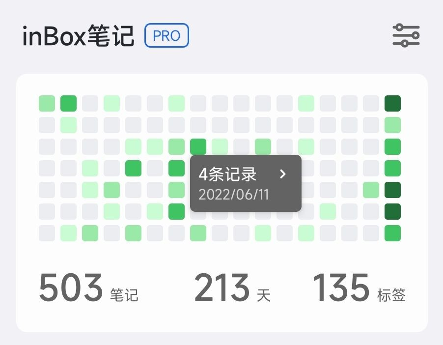

# 热力图

热力图是一种按照日期来展示记录状态的形式，可以帮助我们更好的最终自己的记录状态。

热力图的每一个小格子代表一天，如果在这一天记录了笔记，这个小格子就回被点亮，否则，这天的小格子就是灰色的，一天中记录的笔记数量越多，格子的颜色就越深。

如上图所示，是我自己的记录热力图，一行七个小格子，代表一周，可以看到，最近一周我的每一个小格子都是被点亮的，在8月15那天，记录的颜色最深，说明那天记录的最多，单上一周只有一天是点亮的，其他时间都没有记录。

热力图的每一个小格子，可以被点击，点击后会展示当天记录的数量，然后可以查看那天记录的笔记列表。

> 点击更多按钮可以选择 前一天 | 后一天

使用热力图可以帮助我们更好的追踪自己的记录情况，对自己的笔记频率有更直观的认识。