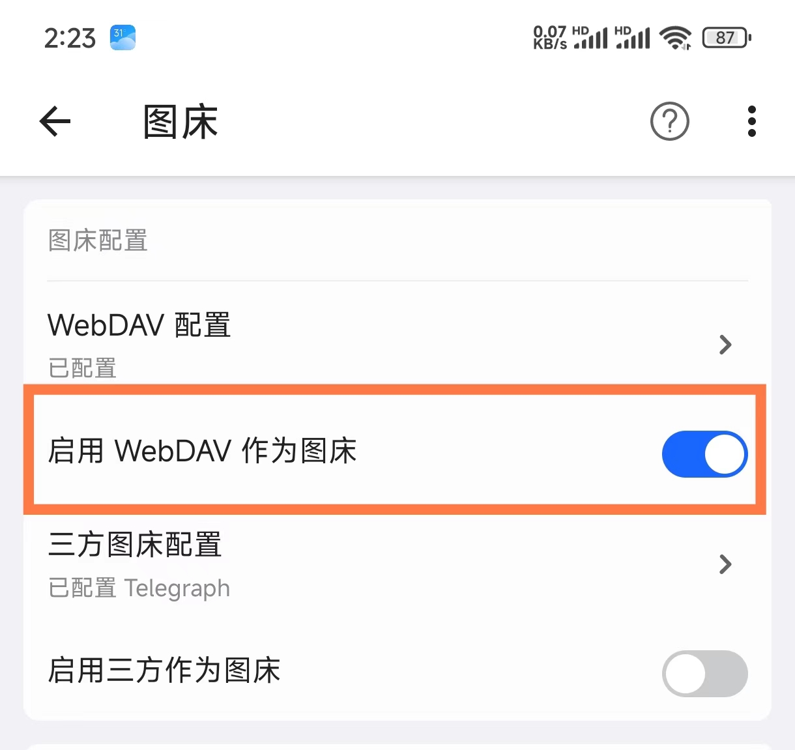

# 图片存储

inBox 是一个本地笔记软件，支持添加图片作为笔记附件，也由于 inBox 是一个本地笔记软件，所以数据优先存储在手机本地，图片数据也是，当你为笔记添加一个图片后，inBox 将会把你相册中选择的图片拷贝一份到 inBox 自己的文件目录，具体地址为：
> /storage/emulated/0/Documents/inBox/Pictures

这是一个手机本地的磁盘目录，你可以通过手机文件管理器找到该文件夹，该文件夹下面存放着你所有 inBox 中添加的图片，即使卸载软件，图片也都不会删除，除非自己手动在 App 中删除了图片或者笔记，或者手机格式化，否则图片将一直存在。

本地图片安全、访问速度快，但与此同时，也有一个弊端，就是当你更换手机时，在另一台手机上进行 inBox 数据恢复后，由于图片数据是一个本地文件路径，在新手机上，将找不到对应的图片，所以跨设备同步数据时，图片将会显示加载失败。

鉴于此，inBox 提供了两个方案：

## WebDAV 作为手机图床
inBox 支持将图片上传到 WebDAV 云盘，这样图片的路径就是一个 http 路径，在另一个手机上使用 inBox 时，inBox 会根据 WebDAV 的 http 路径去下载图片到本地，然后进行展示，这样就可以方便的进行跨设备同步还原图片数据。

## 阿里云、七牛云等主流图床
inBox 支持配置这些主流的三方图床，如果你有自己的图床，你可以使用自己的图床进行配置，在 inBox 中配置 ok 后，每次选择图片就可以上传到自己的图床，这样在笔记中保存的图片链接就是自己图床中的链接，这样无论在哪个软件中，根据这个链接都可以加载的图片。

支持的图床有
- 阿里云
- 又拍云
- 七牛云
- 腾讯云
- SM.MS
- Github