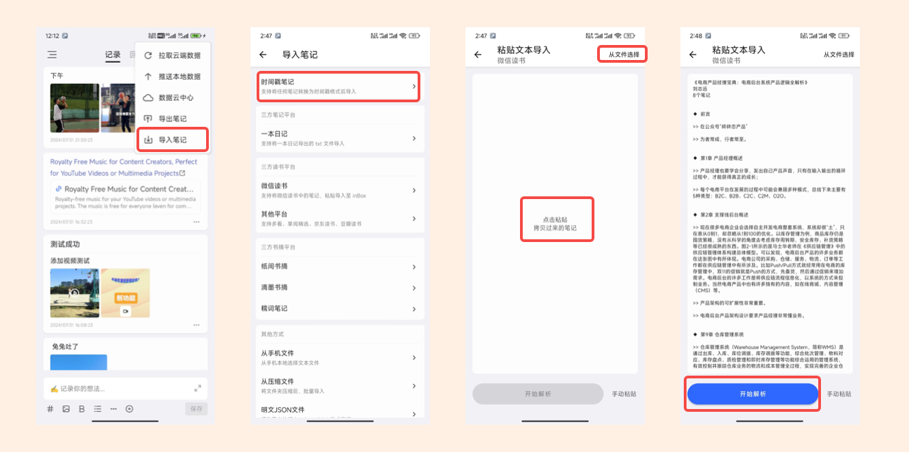
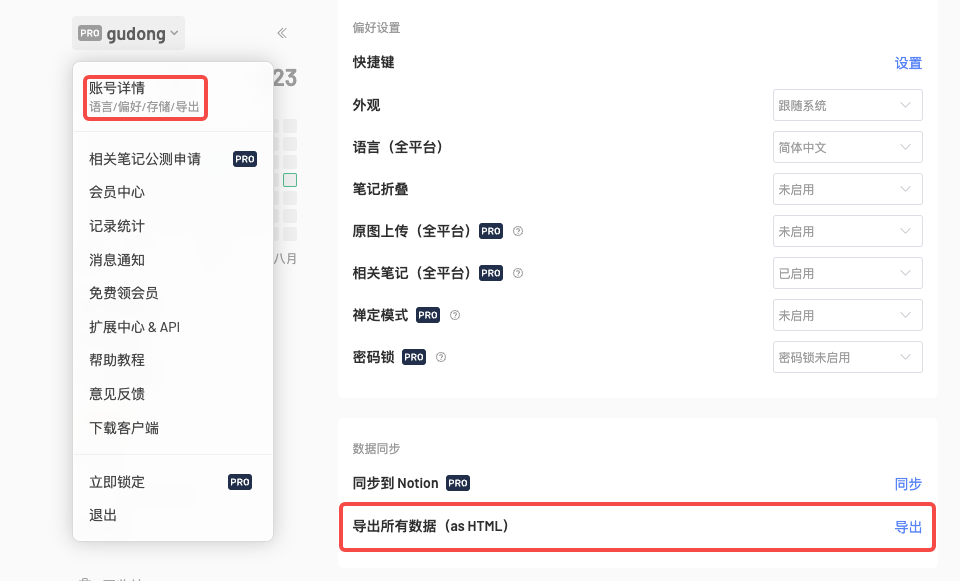
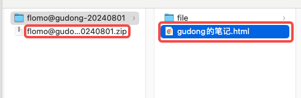
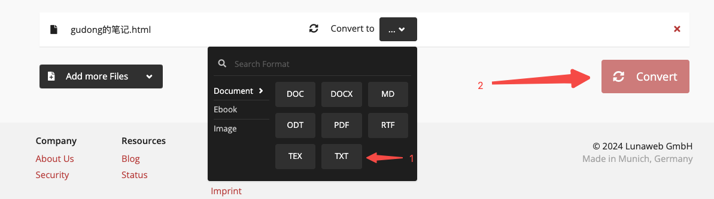
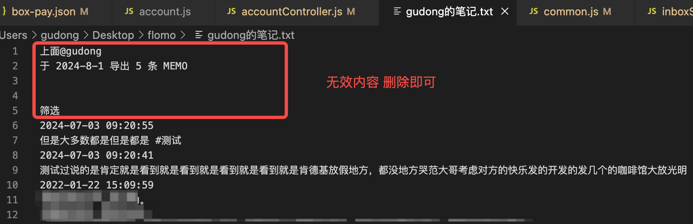

# 如何导入时间戳笔记
为了方便导入更多格式，inBox 定义了一种简易的时间戳笔记格式，如下所示：
```text
2022-08-22 23:06:24
意识到自己的错误可能改正错误更难得。
这就跟程序中的 bug 一样，很多时候改 bug 其实很容易，不容易的是在代码的海洋里定位 bug、查 bug。
2022-08-21 23:06:24
最近 get 到的一个词:预期管理
#咚记/分享 
```
如上就是两个笔记，只是使用时间来分割，只要笔记是这种格式，inBox 就支持导入。

了解更多关于时间戳笔记，可查看[详情](./time_note.md)

## 导入演示
打开 inBox 笔记后，在 inBox 笔记的导入页面中，选择时间戳笔记就可以，如下所示：



## 导入 flomo 笔记
经常有同学问我怎么导入 flomo 笔记，因为 flomo 目前只支持导出 html 格式的压缩文件，**这个文件无法直接导入到 inBox 笔记中**，所以结合 inBox 的时间戳笔记导入，你可以把 flomo 的导出笔记进行格式转换，将压缩文件解压后，将其中的 html 文件先转换为时间戳笔记格式，然后就可以导入了。

下面是具体操作方法：
1. 在 flomo 的网页端选择导出笔记，如下所示


2. flomo 的导出笔记是压缩文件，需要先解压缩，接着找到对应的 html 文件


3. 将上面的 html 文件转换为 txt 格式。
这个需要一个网页在线工具就可以转换，这里推荐:[https://cloudconvert.com/](https://cloudconvert.com/)

该工具是一个运行了 12 年的一家德国公司开发，注重数据安全，并通过了 ISO 27001 认证，以下摘自官网关于安全的申明：

> CloudConvert 致力于维护广泛的安全计划，其中包括技术和组织安全措施。CloudConvert 已通过 ISO 27001 认证，并已开发 ISMS 以完全支持安全性、可用性、处理完整性、机密性和隐私性的信任服务原则 (TSP)。请在下面详细了解我们的安全原则和措施。 更多可查看[https://cloudconvert.com/security](https://cloudconvert.com/security)

尽管如此，但一切取决于你，如果对安全有担心，你可以使用其他工具进行转换。

打开网页后，选择上一步的 html 文件，然后选择转换格式为：txt，点击 转换，稍等片刻后，转换完毕就可以下载。


4、文件处理
打开下载完毕的文件，转换完毕的 txt 文件，几乎已经是一个时间戳格式的文件，只需要删除文件开始的无用文本即可。如下所示：


5、导入 inBox 笔记
上面操作完毕后，复制文件内容，到 inBox 笔记导入即可，或者将文件发送到手机，导入界面支持选择文件导入，选择对应的文件即可。