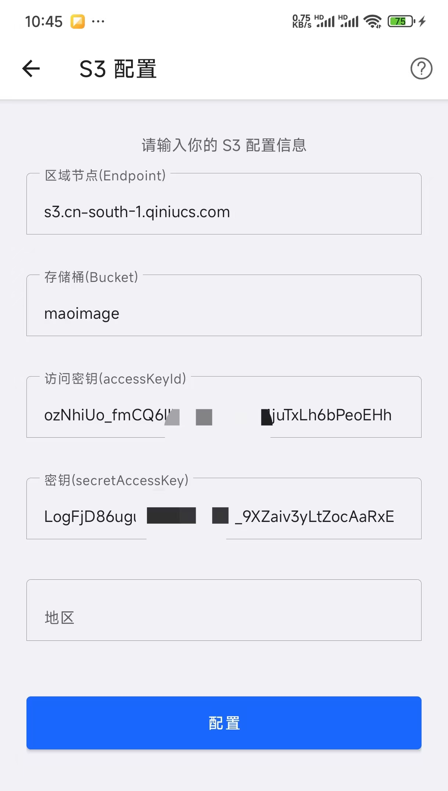
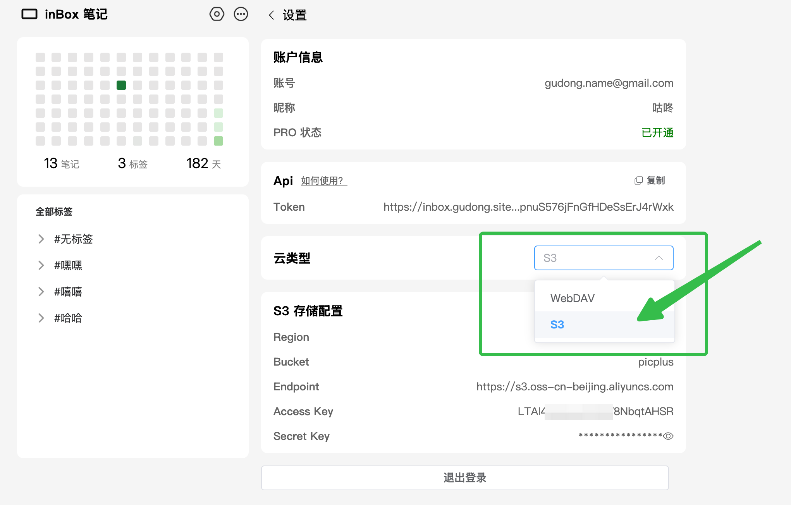
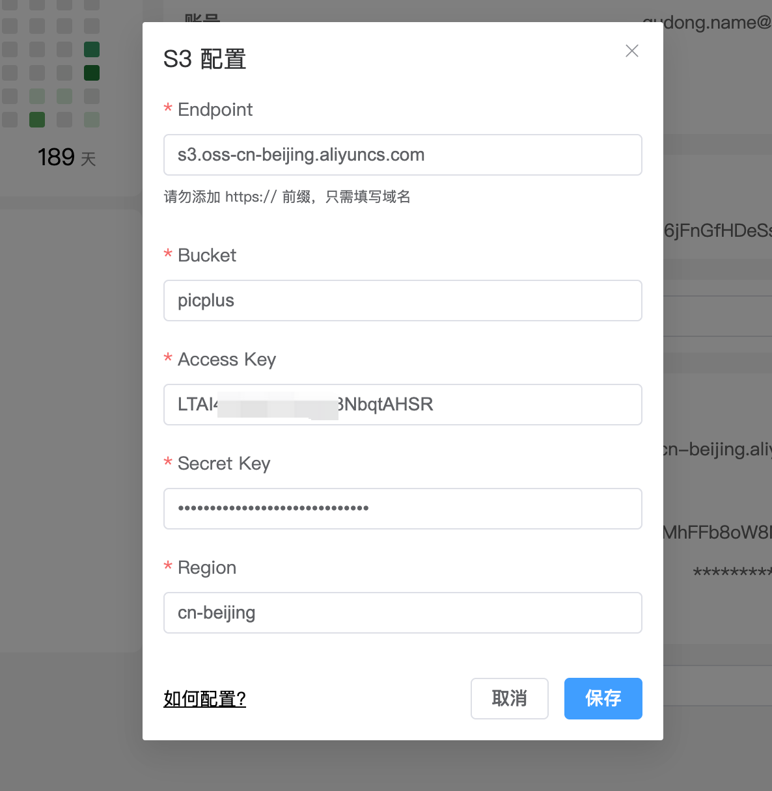

# S3 配置指南
> 如果之前没有接触过 S3，不建议折腾，使用 WebDav 即可。

## S3 简介
S3 是一种云存储标准，现在很多云服务商都支持这个标准，比如阿里云、腾讯云、七牛云等。简单来说就是把文件存到云端，可以随时随地访问。

inBox 笔记支持使用 S3 作为数据存储。这意味着笔记数据、图片、附件、录音等文件都可以存储在 S3 中。使用 S3 作为 inBox 的存储后端有以下好处：

- **快速同步**：数据同步速度快，操作响应及时
- **数据安全**：云存储提供多重备份，确保数据安全

下面分别介绍如何在 inBox 笔记 App 和网页版中配置 S3。

## 在手机端配置 S3

1. 打开 inBox 笔记 App，选择右上角更多菜单，打开数据云中心，选择云类型为：S3，然后进入 S3 配置界面。

2. 输入以下配置信息：
   - **区域节点（Endpoint）**：S3 服务的访问节点。
   - **存储桶（Bucket）**：存储数据的容器。
   - **访问密钥（Access Key ID）**：用于身份验证的访问密钥。
   - **密钥（Secret Access Key）**：用于身份验证的密钥。
   - **地区（Region）**：S3 服务所在的地区。 可不填。

   

3. 点击"配置"按钮，保存配置信息。保存完毕重启 App

## 在网页端配置 S3
> 配置信息跟手机端一致，不过需要注意，**网页端需要配置跨域规则，否则会导致 inBox 网页版无法正常访问您的 OSS 存储空间**。

### 配置步骤
下面以阿里云为例，你也可以使用腾讯云、七牛云、[缤纷云](https://www.bitiful.com/)等。

> 推荐使用[缤纷云](https://www.bitiful.com/),价格合适

#### 1. 准备工作
- 注册并登录阿里云账号
- 开通 OSS 服务
- 创建一个 Bucket（存储空间）

#### 2. 获取配置信息
1. 在阿里云 OSS 控制台找到您的 Bucket
2. 记录以下信息：
   - Endpoint（地域节点）
   - Bucket 名称
   - AccessKey ID
   - AccessKey Secret

#### 3. 配置 inBox
1. 打开 inBox 网页版设置，将云存储类型切换为 S3

2. 点击编辑，在 S3 配置弹框里进行配置
3. 填入以下信息：
   - Endpoint：填入 Bucket 的访问域名
   - Bucket：填入 Bucket 名称
   - AccessKey：填入 AccessKey ID
   - SecretKey：填入 AccessKey Secret
   - Region：选择您的 Bucket 所在地域

#### 4. 配置跨域规则（重要）

为确保 inBox 网页版能正常访问您的 OSS 存储空间，需要配置跨域规则：

1. 在阿里云 OSS 控制台中，选择您的 Bucket
2. 在左侧导航栏中，选择"数据安全" > "跨域设置"
3. 点击"创建规则"
4. 配置以下内容：
   - 来源：填写 `https://inbox.gudong.site`
   - 允许 Methods：选择 GET、POST、PUT、DELETE、HEAD
   - 允许 Headers：** 这里直接填  `*` **
   - 暴露 Headers：添加 `ETag` 和 `x-oss-request-id`

如下图所示：

> 不同的云，配置方式可能略有不同，如果找不到，你可以百度搜素一下，如何在你的云服务商上配置跨域规则。

### 验证配置

完成配置后：

1. 保存设置
2. 尝试添加一条新笔记
3. 观察同步状态

如果笔记能够正常同步，说明配置成功。

## 注意事项

- 请妥善保管您的 AccessKey，不要泄露给他人
- 建议定期更换 AccessKey，提高安全性
- 如遇到同步问题，请检查跨域配置是否正确

## 相关文档
- [阿里云 OSS 适配 S3 配置文档](https://help.aliyun.com/zh/oss/developer-reference/use-amazon-s3-sdks-to-access-oss)
- [腾讯云 OSS 适配 S3 配置文档](https://cloud.tencent.com/document/product/436/37421)
- [七牛云 OSS 适配 S3 配置文档](https://developer.qiniu.com/kodo/12553/S3%20SDK%20sample)

通过以上步骤，用户可以在 inBox 笔记 App 中成功配置 S3 信息，将笔记数据、图片、附件、录音等文件存储在 S3 中。