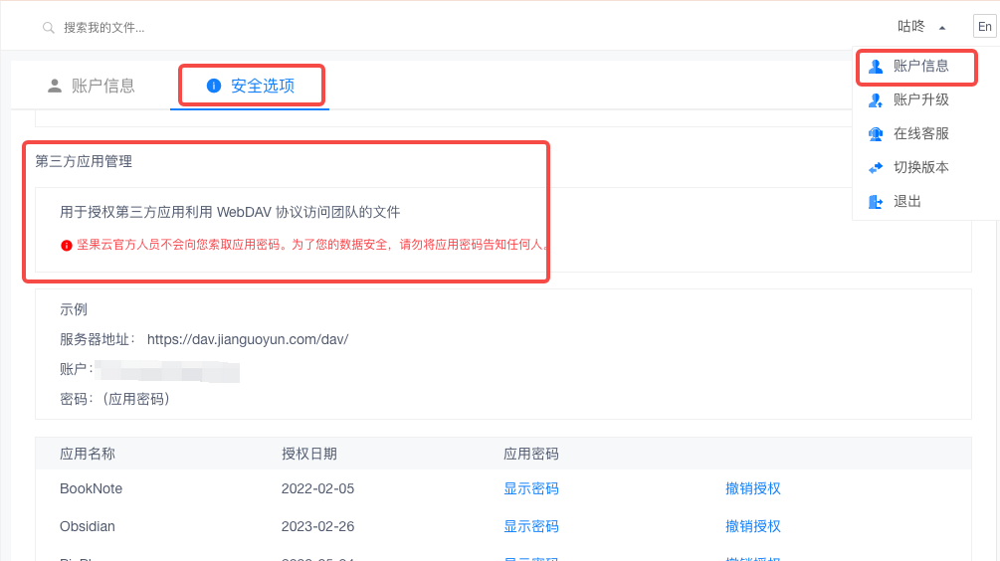
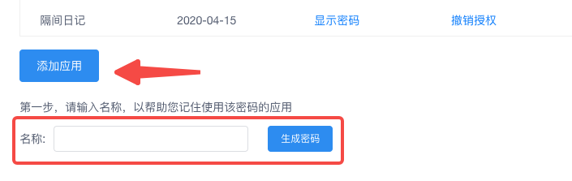
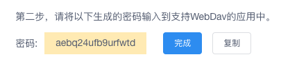
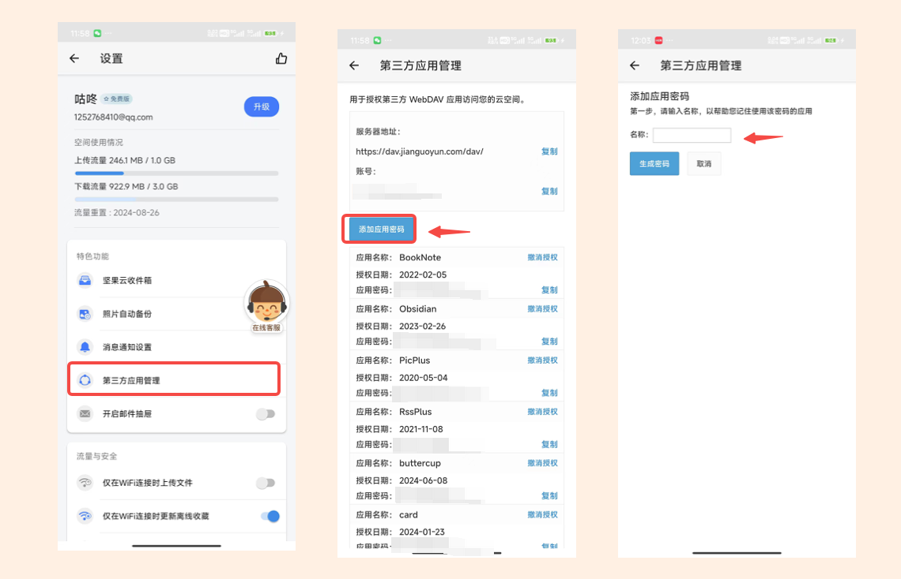
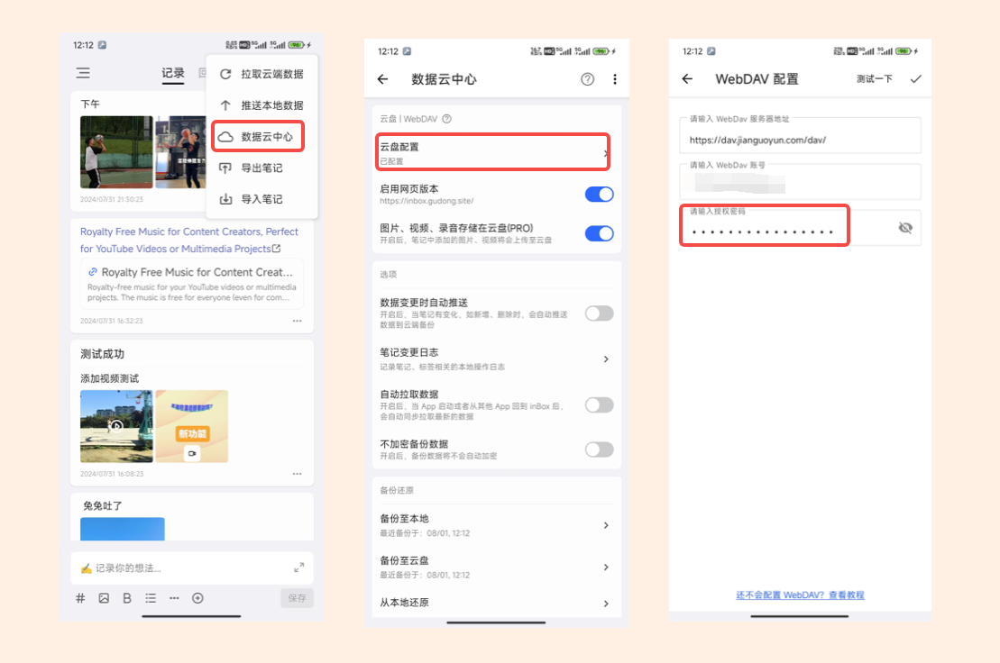
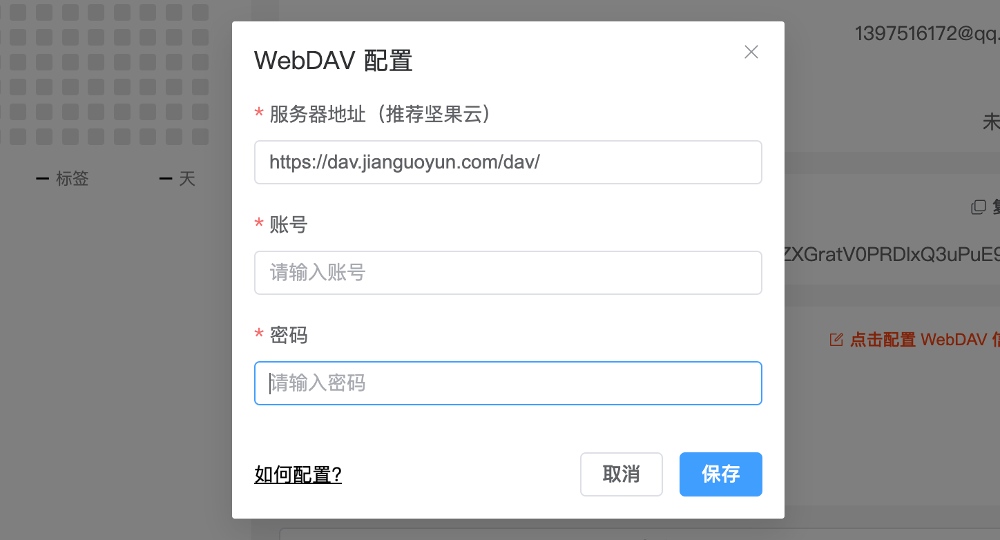
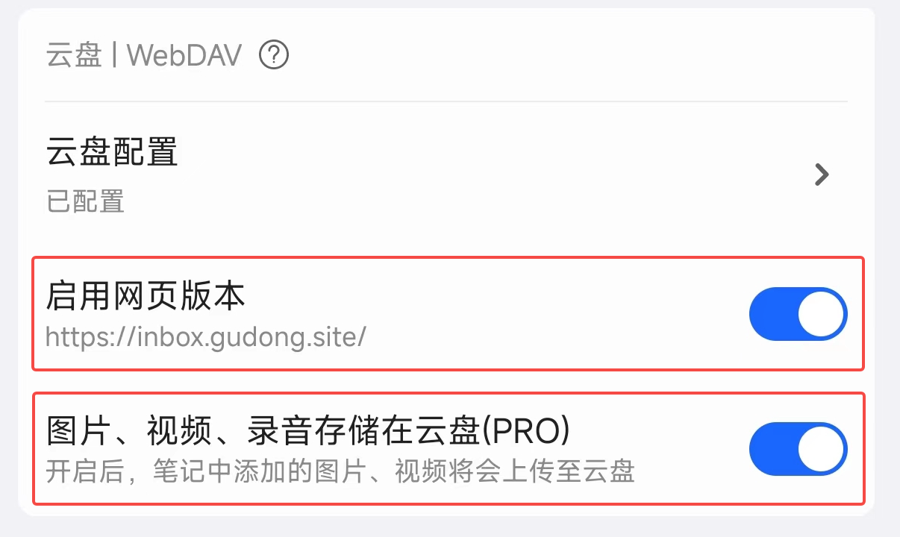

# 如何配置 WebDAV 云盘

inBox 支持配置 WebDAV 云盘作为个人笔记云，该功能为免费功能，本文档将以坚果云为例，为大家介绍如何配置坚果云为 inBox 的个人云盘。

整个配置过程并不复杂，简单将分三步：
1. 注册坚果云
2. 在坚果云中添加一个三方应用授权
3. 在 inBox 笔记中使用上面的授权密码进行配置。

---

可能你会有疑问，WebDAV 跟坚果云是什么关系？
> WebDAV 是一个标准的云盘协议，坚果云是基于这个协议的云盘。

> WebDAV 可能有点拗口不好理解，我举个🌰，比如咱们定义一个名叫 「Mobile-Phone」 的协议，协议要求只要能接打电话、有屏幕、能联网的手持设备，就符合「Mobile-Phone」协议，那现在的小米手机就是这个协议的实现。

>协议是一套公之于众的标准，是一种能力标准，inBox 使用了这种能力，而国内的坚果云实现了 WebDAV 协议，所以坚果云就可以在 inBox 中作为 WebDAV 云盘使用。除了坚果云，还有 123 云盘等其他云盘也支持 WebDAV 协议，但是坚果云更加稳定好用，所以推荐坚果云。

## 1. 注册坚果云
你可以选择在手机软件市场内**下载坚果云 App** 或者在电脑端打开坚果云网站：[https://www.jianguoyun.com](https://www.jianguoyun.com)

这个很简单，就不展开讲了。

## 2. 添加三方应用
在坚果云中添加一个应用后，坚果云会为这个应用生成一串密码，**密码就是一个钥匙，是你授予这个应用可以访问你坚果云数据的钥匙**。比如你添加了一个 inBox 的应用，把生成的密码填入 inBox 笔记软件后，inBox 就可以访问你坚果云中的数据了。

添加三方应用可以在网页里完成，也可以在坚果云的手机客户端中完成，下面分别截图演示一下：

### 2.1 通过坚果云网页添加三方应用
登录坚果云后，在**网页右上角点击个人昵称后，打开账户信息**，然后选择**安全选项**，就可以看到三方应用的管理页面了，或者直接点击链接[https://www.jianguoyun.com/#/safety](https://www.jianguoyun.com/#/safety)，也可以直达这个页面，如下所示：

点击这里的添加按钮，输入要添加应用的名称，比如填入：inBox，然后选择生成密码，就完成了一个第三方应用的添加。

添加完毕后，会提示密码已生成，复制后在 inBox 中添加即可。

### 2.2 通过坚果云 App 添加三方应用
下载安装好坚果云 App 后，打开坚果云的设置页面，选择第三方应用管理页面，在这里就可以添加应用密码。如下所示：

添加完毕后，会提示密码已生成，复制后在 inBox 中添加即可。

## 3. 配置云盘
### 3.1 在 inBox App 中配置
在 inBox 首页点击**右上角更多菜单**，选择**数据云中心**，然后点击**云盘配置**，接着在下一个页面中分别填入
1. 服务器地址：默认已经填好了，不需要填写，如果是其他云盘，可以自行修改。
2. 账户名称：**是坚果云主账号，是你的邮箱**。
3. **三方应用密码：这里填写上面生成的密码**，不是坚果云账号自己的密码，切记不要填错了。

**特别提醒：**
# 账户填写的是坚果云主账号，也就是你的注册邮箱，不是添加应用时自己写的名称

---

如上，就配置好了坚果云作为 inBox 的个人云盘，测试成功后，点击右上角保存即可。

### 3.2 在 inBox 网页 中配置
登录 inBox 笔记网页端后，选择左上角的设置按钮，在设置页面中，点击按钮：配置 WebDAV 信息，在面板中填写信息即可。

## 4、其他云盘
除了坚果云，国内还有 123 网盘，也支持 WebDAV，但是需要 Vip，在 123 网盘配置 WebDAV 时，除了以上的步骤，还需要注意一点：

添加好三方应用后，在 123 网盘根目录手动创建一个名为：inBox 的目录。

## 5、更多

### 5.1 inBox 网页版
开启个人云盘后，建议选择启用网页版本，这样就可以在网页端，访问 inBox 笔记，网页版介绍可查看：[inBox 网页版](./web.md)。

启用网页版时，会把坚果云配置信息同步至 inBox 后端，以便 inBox 网页端使用坚果云进行笔记拉取上传操作。

### 5.2 图片视频存储
启用坚果云后，你可以选择将笔记中的图片、视频存储在坚果云，这样笔记和图片、视频就都存储在了个人云盘，方便更换设备时，丢失图片、视频等数据。（Tip:该功能为高级功能，PRO 用户专享）
