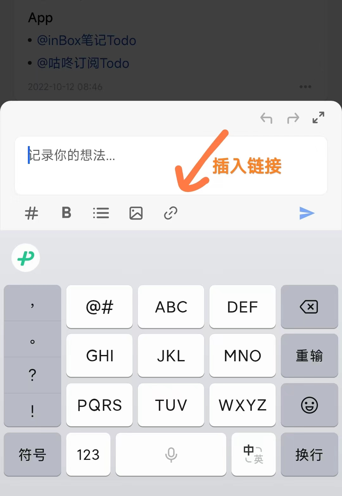

# 笔记关联

在笔记中，尽管每一篇笔记，都是一个独立的个体，但当我们的笔记逐渐增多，不同的笔记之间就不可避免的会产生关系。

比如之前已经记录了一篇关于 **如何高效学习** 的思考，如下所示：

过了一段时间，再次新建一篇有关学习主题的思考时，就有可能想把之前的笔记关联过来，如下所示，在笔记中可以插入一个链接。

tip:如何插入？

> 点击笔记操作栏的 🔗 按钮，即可弹起搜索笔记的面板，找到笔记，然后选择插入。

当插入成功，发布笔记后，直接在当前笔记中引用，就像网页中的超链接，点击链接就能跳转到对应的笔记。

---

目前实现该功能的笔记应用有很多，Notion 就是如此，目前 inBox 笔记也已经支持，并且免费开放，每个用户都可以使用。

## 双向链接的好处

让笔记之间更容易的连接、流动，更符合大脑的思考方式，是网状式的结构，也是一种更高效的信息组织形式。

## 最佳实践

可以新建一个笔记置顶，然后在笔记中引用不用笔记链接，这样就可以在 inBox 中建立一个笔记目录，方便自己去管理自己的笔记，如下所示：

