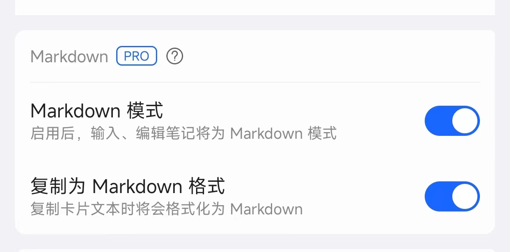
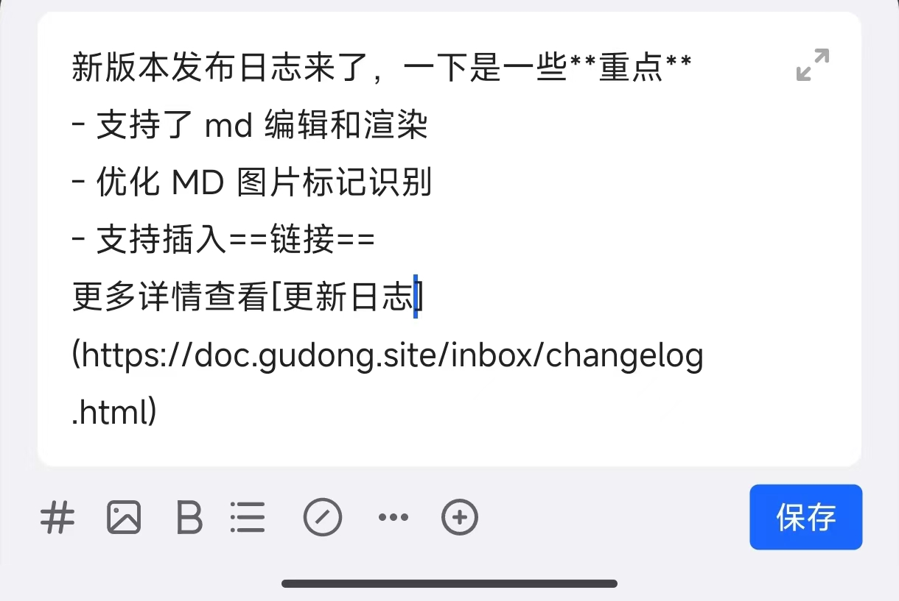
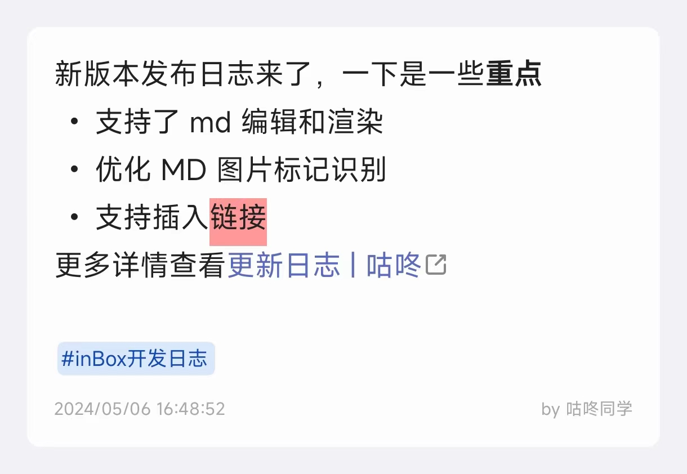

# Markdown
Markdown 是一种非常简单而受欢迎的文本格式，它使用简单的符号和文本结构来格式化文本。比如，用双星号 ** 包围可以加粗，用星号 * 包围一段文字就可以将其变成斜体。更多关于 Markdown 的介绍可以查看 [Markdown 官方教程](https://markdown.com.cn/intro.html#markdown-%E6%98%AF%E4%BB%80%E4%B9%88%EF%BC%9F)。

inBox 在 1.6.50 版本开始，将会支持 Markdown 模式，只需要**在偏好设置中手动进行开启**，如下所示：

> Tip：该功能为 PRO 功能，但普通用户也可以进行免费体验，普通用户可以创建 5 篇笔记，超过条数后，将不能发布新的笔记。

> 偏好设置具体位置：inBox 主页 > 左上角菜单 > 设置 > 偏好设置

开启后，在进行笔记编辑时，点击 inBox 中的各个标记按钮时，将会按照 Markdown 的标记规范去编辑笔记，比如点击加粗按钮，将会在输入框中自动插入四个星：****，并将光标移动到中间位置；点击无序列表，则会插入连字符：- 

## 支持的 Markdown 标记
下面的标记是 inBox 目前支持的 Markdown 标记符号，已经覆盖了大部分基础标记。
| 标记 | 符号 | 示例 | 效果 |
| --- | --- | --- | --- |
| 加粗 | **** | \*\*爱德华兹\*\*真厉害 |**爱德华兹**真厉害 |
| 链接 | \[\]\(\) | \[咕咚同学\]\(https://gudong.site)的主页 |[咕咚同学](https://gudong.site)的主页 |
| 任务列表 | - [ ] | - [ ] 发布 inBox 1.6.50 版本 | <ul><li><input type="checkbox"> 发布 inBox 1.6.50 版本</li></ul> |
| 无序列表 | -  | - First item | <ul><li>First item</li></ul> |
| 高亮 | == | \=\=高亮这段\=\=文本 |<mark>高亮这段</mark>文本 |
| 下划线 | \<u\>\<\/u\> | 狼牙月，伊人\<u\>憔悴\<\/u\> |狼牙月，伊人<u>憔悴</u> |
| 引用 | > | > 三人行，必有我师 | <blockquote>三人行，必有我师</blockquote> |
| 分割线 | --- | --- 将会显示一个分割线 | 
这是一些文本。

这是另一些文本。
 |

开启 Markdown 模式后，在新增笔记和编辑笔记时，都将会按照纯文本去编辑，如下所示：

保存后展示时，还是按照原来的方式进行富文本渲染展示，如下所示：

## 其他标记
Markdown 标记有很多，不过考虑到 inBox 并不是一个写作软件，对于更全、更复杂的标记并没有进行交互支持，但还是对**部分常用标记支持了渲染**，也就是只要笔记中有这些标记符号，inBox 会进行渲染，如下是目前额外支持渲染的标记：

| 标记 | 符号 | 示例 |效果 |
| --- | --- | --- | --- | 
| 标题 | #  | # 一级标题 |无法展示 |
| 斜体 | *  | \*文本\* |*文本* |
| 删除线 | ~~~~  | \~\~The world is flat.\~\~ |~~The world is flat.~~ |
| 代码 | ``  | \`hello world\` | `hello world` |

手动插入这些标记可能麻烦，如果你有在 inBox 中插入这些标记的需要，你可以通过 inBox 的[快捷插入功能](quick.md)，自定义快捷内容进行插入。

## 为什么支持 Markdown
Markdown 是一种优秀的文本标记格式，使用 Markdown 可以让写作者更专注于内容，而不用关心排版，对于很多写作者而言，Markdown 已经驾轻就熟，而 inBox 作为一个卡片笔记，其中的笔记会作为一篇文章的一部分而存在，考虑到很多作者采用 Markdown 去写文章，所以在 inBox 中在编写卡片时，一步到位采取 Markdown 标记符，省去了后续二次排版的过程。

另外 Markdown 已经被很多写作者习惯，大家习惯于通过 Markdown 去记录写作。

除此之外，还有一个技术条件。inBox 在开发之初，对于富文本的存储方案考虑再三后，决定底层使用 Markdown 的规范去进行存储，也就是之前的加粗、无序列表、高亮这些文本，在手机本地存储时，都是按照 Markdown 规范，把他们转义为了对应的 Markdown 标记字符后，再存储在手机本地，所以，从一开始起始 inBox 就是向着 Markdown 在靠拢。

最后一个原因：个人喜好，从 15 年开始接触到 Markdown 后，算是彻底的喜欢上了 Markdown，它很极客，很高效，后续所有的文章，我都采用 Markdown 去完成，所以也算是一个执念，inBox 也要支持 Markdown 模式。

## 后续
Markdown 标记很多，但常用就是那几个基础标记符号，目前 inBox 都做到了基本语法的 100% 支持，对于表格等其他复杂标记，暂不考虑去做支持，对于 inBox 而言，还是更专注于输入的便利性，笔记的安全性以及操作的流畅性。

