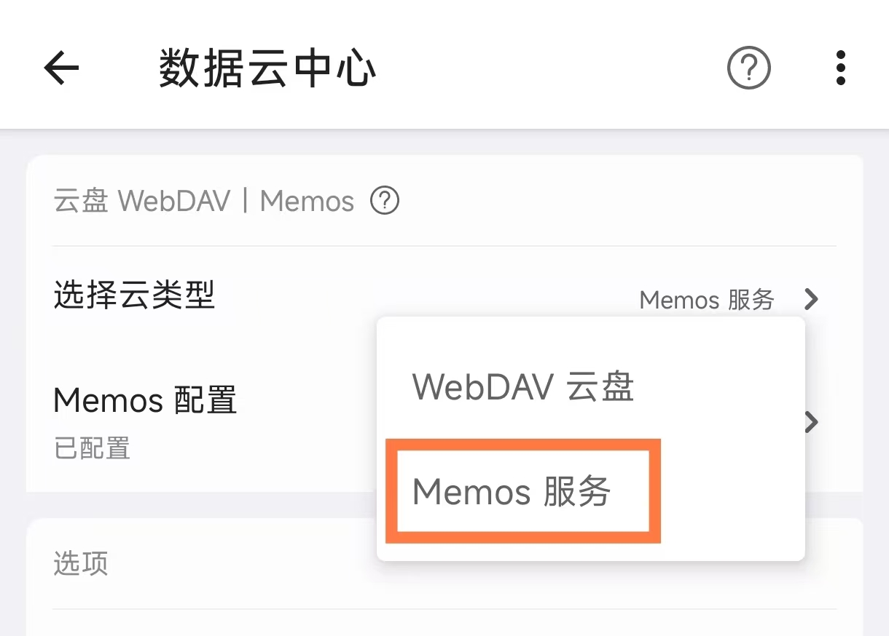
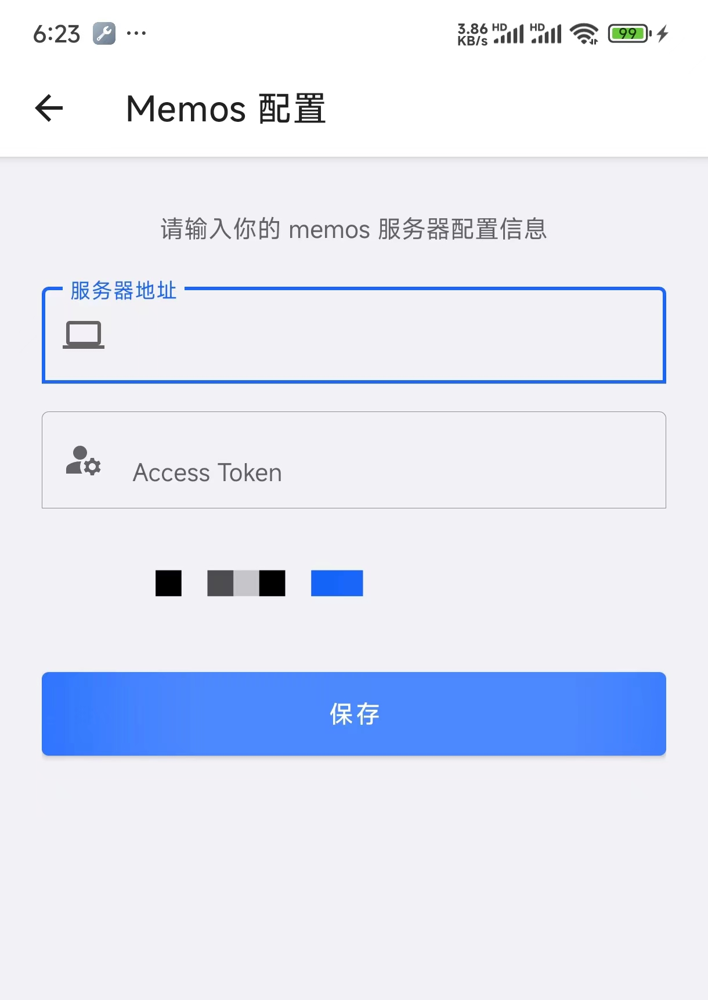

# Memos 
[Memos](https://www.usememos.com/) 是一个开源的轻量级 Web 笔记软件，支持部署在私有服务器，开源免费，纯文本，支持 Markdown，如下图所示：

由于 Memos 支持开放 Api, 所以 inBox 笔记对 Memos 进行了支持，如果你在网页上使用 Memos，那么你可以通过在 inBox 中配置对应的 token，就可以将 inBox 笔记作为 Memos 的手机客户端。

> 目前 inBox 仅支持 0.21-0.24 版本的 memos，0.25 及以后版本暂不支持。

## 如何配置
> Tip: 同步到 memos 为 inBox PRO 功能，普通用户可以免费发布 7 个笔记进行同步体验。

1、下载 inBox 笔记，[去下载](./download.md)

2、打开 inBox 笔记，点击首页右上角菜单 > 选择 数据云中心 > 选择云类型 >  Memos 服务 

通过以上选择后，需要在下面进行具体的 token 配置

3、打开配置页面，输入 memos 的服务器地址和 token，点击保存即可
- 服务器地址即 Memos 主页网址
- Token 地址可通过 memos 主页设置页面获取

## QA
### inBox 同步 memos 数据的时机是什么？
默认每次启动 App 时会自动拉取一次数据，另外，点击右上角菜单中的拉取云端数据可以进行手动拉取。

### 图片数据如何支持
inBox 中上传的图片，不论上传到本地还是云端，都会在上传成功后，执行 memos 的资源上传，把图片上传到 memos 服务器，另外 inBox 支持展示 memos 空间中的图片资源。
