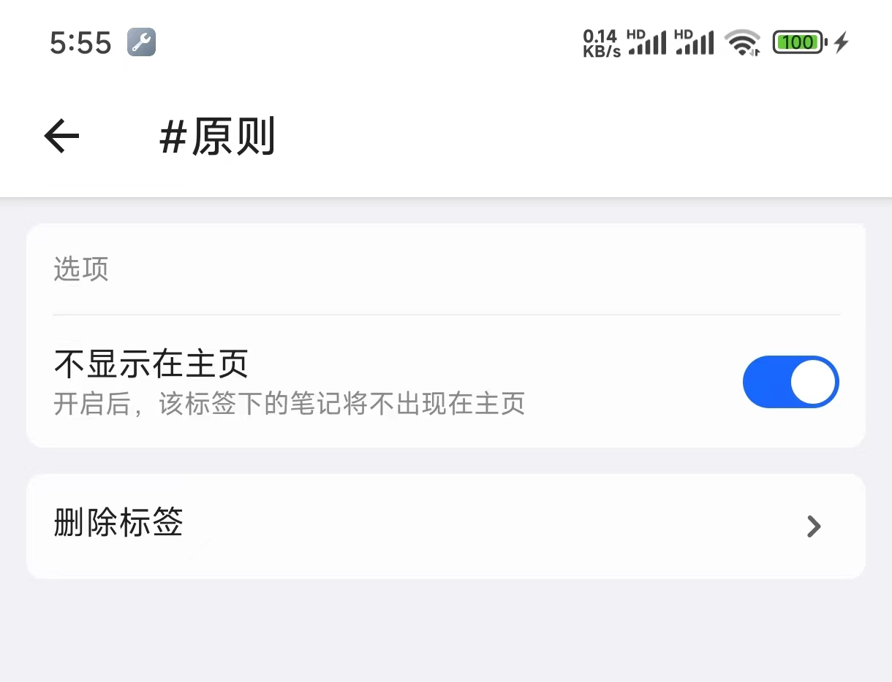
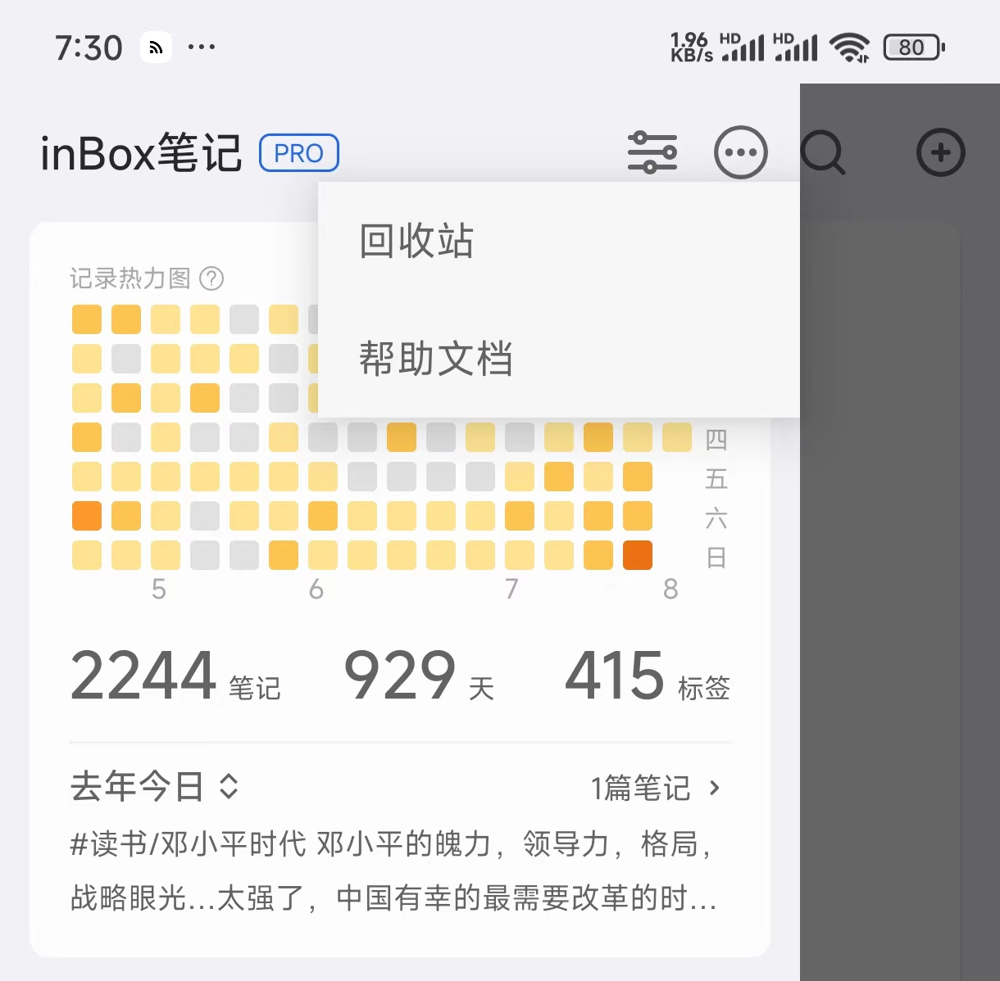

# 常见问题

## 通用操作

### 支持文字中间加图片吗？
支持，在通用设置中开启

### 标签跟笔记关联不正确怎么办？
在设置页面找到实验室，然后选择 「修复标签与笔记的对应关系」即可

> 这并非长久方案，后续我会继续优化这块。

### 如何在新建笔记时设置标题？
点击输入框最右侧的全屏按钮。

###  笔记过长怎么办？
inBox 默认笔记多长就展示多长，如果想要这过长的笔记进行折叠，可以打开设置页面，选择 样式设置，然后开启自动折行。

###  单篇笔记的最大长度是多长？
20000 字符，超过后无法保存。

###  图文卡片可以不显示昵称吗？
点击分享页面右上角的更多按钮，可以选择在分享卡片时不显示昵称。

### 输入框左侧的头像是否可以不现实
在设置 \ 样式 设置中可以关闭。

## 标签相关

### 如何查看标签下的笔记数量
- 1、点击侧边栏中标签的排序按钮，可以在排序页面查看标签下的笔记数量
- 2、点击侧边栏标签，在标签笔记页面可以看到对应的笔记数量

### 如何为内容设置标签？
点击编辑器工具栏的 # 按钮，然后在弹起面板中搜索或者添加标签。

### 如何隐藏指定标签下的笔记
有时不想让部分标签下的笔记出现在主页，你可以选择对这个标签进行设置，inBox 中的标签支持设置，找到标签的三个小点，点击设置，打开后，选择不显示在主页，即可。

###  如何删除标签？

在侧边栏菜单中，点击标签右侧的更多按钮，选择设置，然后点击删除标签，提示：删除标签时会删除该标签下的所有笔记。

###  如何设置多级标签？

我们常用电脑上的文件夹，文件夹可以有子文件夹，在这里，标签也是，可以分为一级二级等多级，只需要输入时，在标签之间加入 / 符号，如#读书/激荡三十年 这样就建立了一个读书标签和激荡三十年的标签，并且前者是后者的父标签。

## 数据相关

### 如何迁移笔记数据到另一个手机？
inBox 支持打包备份数据，然后进行还原，具体可查看：[备份还原教程](./data_recovery.md)

###  回收站在哪里？
主页侧滑菜单，顶部工具栏 -> 更多图标 -> 回收站

###  删除笔记后，回收站保留多久？

150 天，超过 150 天后，被删除的笔记将会在启动 App 时被彻底删除。

###  如何清空回收站？
点击回收站页面右上角的更多按钮，可以选择清空回收站。

###  如何数据备份？
inBox 很重视数据安全，所以提供了数据导入导出，并且提供了 WebDAV 云同步，具体要进行数据备份同步，可以点击首页顶部更多按钮，选择数据云中心进行操作。

###  如何配置WebDAV?
请参考：[如何配置 WebDAV 云盘](./lesson-webdav.md)

##  更多问题
[联系我们](contact.md)