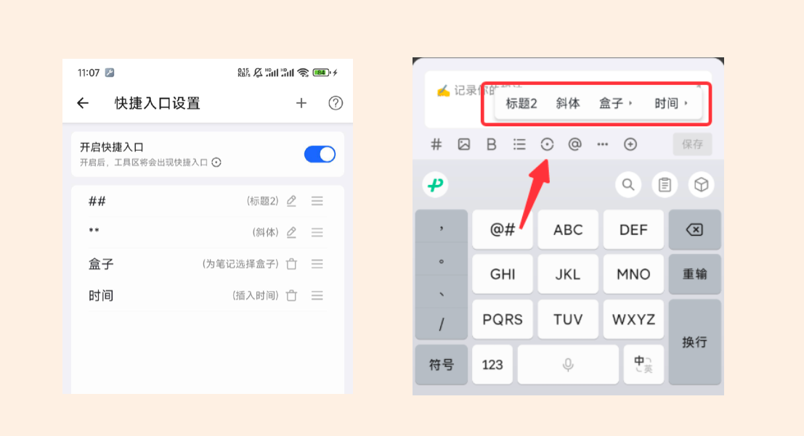
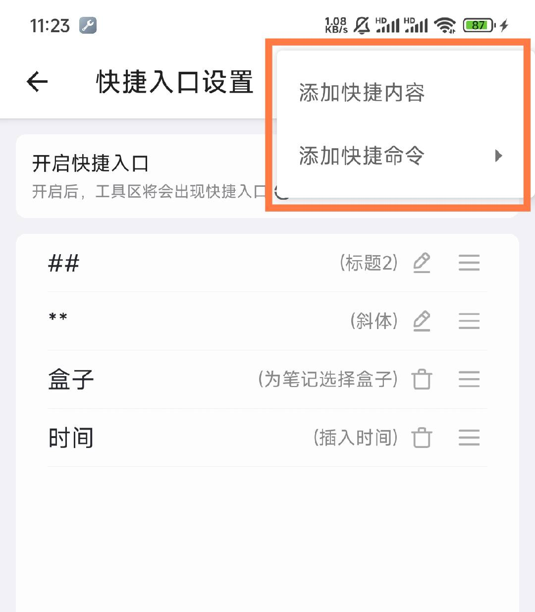
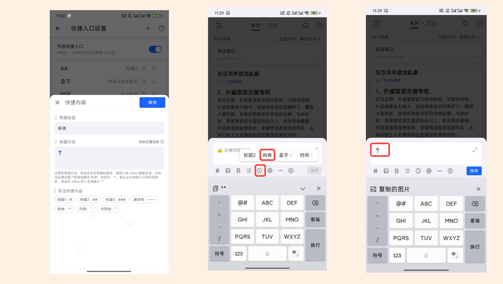
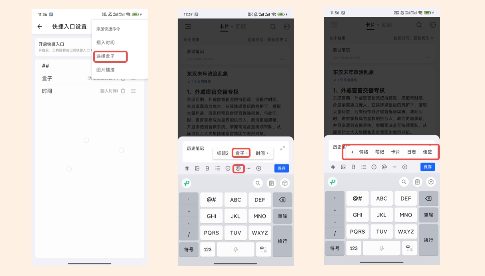

# 快捷操作
为了提高 inBox 输入、操作效率，inBox 支持了快捷插入功能，如下所示，可以在快捷入口中心页面开启快捷插入入口，开启后，在工具栏中将会出现快捷入口。

快捷插入支持以下两种类型：

## 快捷内容

该类型用于在文本框内插入特定的内容，你可以自定义要插入的字符，只需要设置**快捷输入的标题和内容**。

比如标题定义为：斜体，内容定义为 **，这样在工具栏的快捷入口将会出现，斜体这个入口，点击斜体，就会在输入框中插入 **

## 快捷操作
除了内容，还支持快捷操作，这里支持添加快捷操作，目前支持三种
- 指定笔记盒子
- 添加时间
- 插入图片链接
根据自己需求添加后，就可以在快捷入口进行指定的操作。

## 其他

普通用户支持配置一个快捷项，PRO 用户无限制，可以添加多个快捷短语，并且可以支持拖拽排序，如果要删除，点击编辑按钮，可以编辑标题跟内容，标题要求尽可能的短小，最多三个字符，在页面底部就可以选择删除。
