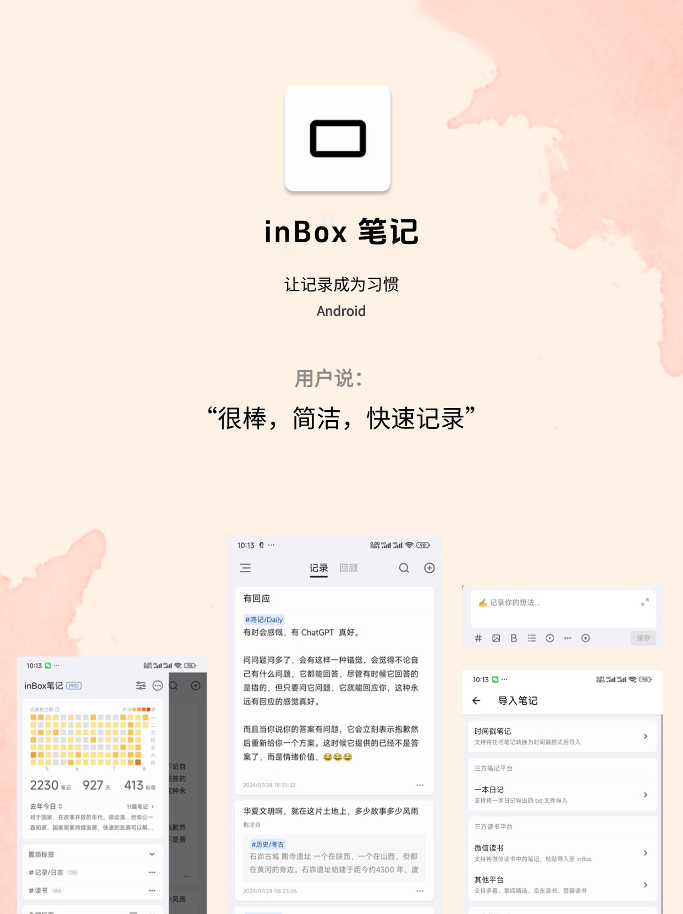

# inBox 笔记

inBox笔记是一个本地优先，记录灵感、想法的笔记软件。

它有如下特点：
- 本地优先，数据离线，操作体验流畅，灵活的数据导入导出。
- 聊天式输入，打开应用就记录。
- 无分类，使用标签管理笔记。
- 去中心化，使用 WebDAV 对自己的数据云存储，支持网页版访问 WebDAV 数据。
- 随机回顾，支持应用内随机回顾和桌面小组件回顾，温故知新。
- Markdown 标记支持，支持粗体、无序列表、高亮、下划线、中划线

## 下载地址
[去下载](download.md)

## 一些其他链接
- [快速上手](guide.md)
- [更新日志](changelog.md)
- [Markdown 支持](markdown.md)
- 导出教程 [导出到思源](export_siyuan.md) | [导出到 Obsidian](export_obsidian.md)
- [本地数据备份还原](data_recovery.md)
- [常见问题](qa.md)
- [inBox笔记可以用来做什么?](experience.md)
- [inBox缘起](reason.md)
- [联系我们](contact.md)