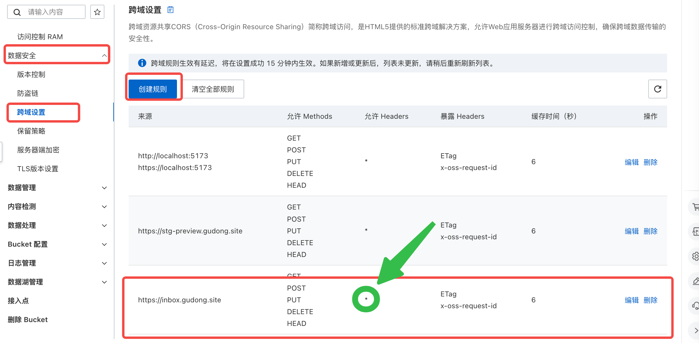

# S3 存储配置问题排查指南

本文档帮助您解决在使用 S3 兼容存储（如七牛云）时遇到的常见配置问题。

---

## 问题一：配置跨域规则（重要）

- **为确保 inBox 网页版能正常访问您的 OSS 存储空间，需要配置跨域规则：**
- **为确保 inBox 网页版能正常访问您的 OSS 存储空间，需要配置跨域规则：**
- **为确保 inBox 网页版能正常访问您的 OSS 存储空间，需要配置跨域规则：**

1. 在阿里云等其他云的控制台中，选择对应的 Bucket
2. 找到 "跨域设置" 不同云不一样，一般在安全或者什么分组下，找不到可以问问 AI 
3. 点击"创建规则"
4. 配置以下内容：
   - 来源：填写 `https://inbox.gudong.site`
   - 允许 Methods：选择 GET、POST、PUT、DELETE、HEAD
   - 允许 Headers：** 这里直接填  `*` **
   - 暴露 Headers：添加 下面内容

```java
ETag
x-oss-request-id
```

如下图所示：

这是阿里云



这是七牛云


> 不同的云，配置方式可能略有不同，如果找不到，你可以百度搜素一下，如何在你的云服务商上配置跨域规则。


## 问题二：区域（Region）配置错误

### 现象

- 连接测试失败
- 提示区域不匹配
- 上传/下载无法进行

### 解决方法

配置 S3 存储时，**区域（Region）必须正确填写**。请按以下步骤操作：

#### 1. 登录七牛云控制台

进入「对象存储」→「空间管理」→ 查看所属区域，比如华北，华南等

#### 2. 对照官方文档填写

请访问七牛云官方文档，查看区域代码与 S3 Endpoint 的对应关系：

**[七牛云 S3 访问域名文档](https://developer.qiniu.com/kodo/4088/s3-access-domainname)**

#### 4. 区域代码对照表

| 存储区域 | 区域代码（Region ID） | S3 Endpoint |
|---------|---------------------|-------------|
| 华东-浙江 | `cn-east-1` | s3.cn-east-1.qiniucs.com |
| 华东-浙江2 | `cn-east-2` | s3.cn-east-2.qiniucs.com |
| 华北-河北 | `cn-north-1` | s3.cn-north-1.qiniucs.com |
| 华南-广东 | `cn-south-1` | s3.cn-south-1.qiniucs.com |
| 北美-洛杉矶 | `us-north-1` | s3.us-north-1.qiniucs.com |
| 亚太-新加坡 | `ap-southeast-1` | s3.ap-southeast-1.qiniucs.com |
| 亚太-河内 | `ap-southeast-2` | s3.ap-southeast-2.qiniucs.com |
| 亚太-胡志明 | `ap-southeast-3` | s3.ap-southeast-3.qiniucs.com |

#### 5. 在 inBox 笔记中填写

将查询到的区域代码填写到配置项中：
- **区域（Region）**：填写区域代码（如 `cn-east-1`）
- **Endpoint**：填写对应的 S3 Endpoint（如 `s3.cn-east-1.qiniucs.com`）

---

## 问题三：图片无法访问/文件加载失败

### 现象

- 上传成功但图片无法显示
- 提示文件不存在或无权访问
- 返回 403 错误

### 解决方法

这个问题通常是因为存储空间的**访问权限**设置为私有导致的。请按以下步骤修改：

#### 1. 登录七牛云控制台

进入「对象存储」→「空间管理」→ 选择您的存储空间

#### 2. 修改访问权限

点击「空间设置」→「访问控制」

#### 3. 设置为公开空间

将访问权限修改为：

```
公开空间（Public）
```

> **注意**：inBox 笔记需要能够直接访问您上传的图片和文件，因此必须设置为公开访问。如果您对数据安全有顾虑，建议：
> - 使用独立的存储空间用于笔记附件
> - 定期审查空间内容
> - 启用七牛云的防盗链功能

#### 4. 等待生效

权限修改后通常**立即生效**，如果 CDN 有缓存，可能需要等待几分钟。

---

## 其他 S3 兼容服务

如果您使用的是其他 S3 兼容存储服务（如阿里云 OSS、腾讯云 COS、MinIO 等），配置方式类似：

1. **区域/Region**：请查阅对应服务的官方文档
2. **Endpoint**：填写服务提供商的 S3 Endpoint（**不要包含协议前缀**，如 `https://`）
3. **访问权限**：确保空间/Bucket 为公开可读状态

### 支持的服务商

| 服务商 | 状态 | Endpoint 示例 |
|--------|------|---------------|
| 七牛云 Kodo | ✅ 支持 | `s3.cn-east-1.qiniucs.com` |
| 阿里云 OSS | ✅ 支持 | `oss-cn-hangzhou.aliyuncs.com` |
| 腾讯云 COS | ✅ 支持 | `cos.ap-guangzhou.myqcloud.com` |
| AWS S3 | ✅ 支持 | `s3.amazonaws.com` |
| MinIO | ✅ 支持 | 自定义地址 |
| Cloudflare R2 | ❌ 暂不支持 | - |

### 暂不支持的服务

**Cloudflare R2**

目前 inBox 笔记暂不支持 Cloudflare R2。原因是：

- Cloudflare R2 不支持 AWS SDK 使用的 Streaming SigV4 认证方式（`STREAMING-AWS4-HMAC-SHA256-PAYLOAD`）
- 该问题会导致上传文件时返回 `501 NotImplemented` 错误

**替代方案**：
- 推荐使用七牛云、阿里云 OSS、腾讯云 COS 等国内云存储服务
- 或继续使用 WebDAV 方式进行云端同步

---

## 仍然无法解决？

如果您按照以上步骤操作后仍然无法正常使用，请：

1. 检查 Access Key 和 Secret Key 是否正确
2. 确认存储空间所在区域与配置的区域代码一致
3. 查看七牛云控制台的「空间日志」了解详细错误信息
4. 联系 inBox 笔记客服获取支持

---

*最后更新：2025-01-11*
