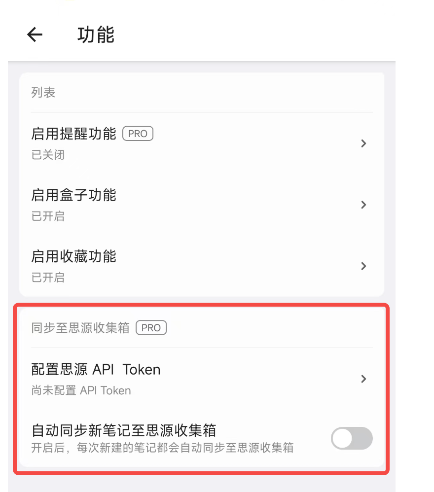
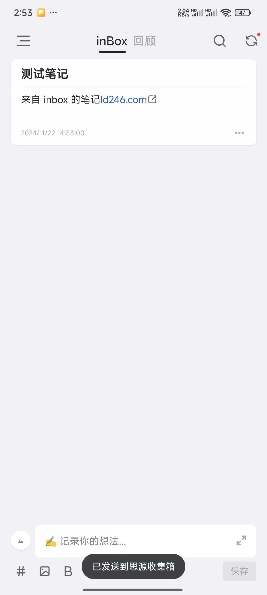

# 思源
[思源笔记](https://github.com/siyuan-note/siyuan) 是一款隐私优先的个人知识管理笔记系统。

由于 思源笔记 支持开放 Api，通过 Api 可以将笔记写入思源收集箱， 所以 inBox 笔记对 思源笔记的收集箱进行了支持，这样就可以通过在 inBox 中配置对应的 token，就可以将 inBox 笔记作为 思源笔记 的手机客户端。

## 如何配置
> Tip: 同步到 思源笔记 为 inBox PRO 功能验。

1、下载 inBox 笔记，[去下载](./download.md)

2、打开 inBox 笔记，点击首页左上角菜单 > 设置 > 功能 > 同步至思源收集箱

在这里填入思源笔记的 API Token 即可，具体可以按照官方文档去获取：地址[https://siyuannote.com/docs/article/1725202960](https://siyuannote.com/docs/article/1725202960)

配置完毕后，打开同步开关，后面每次发送笔记后，都会自动同步到思源收集箱。

## QA
