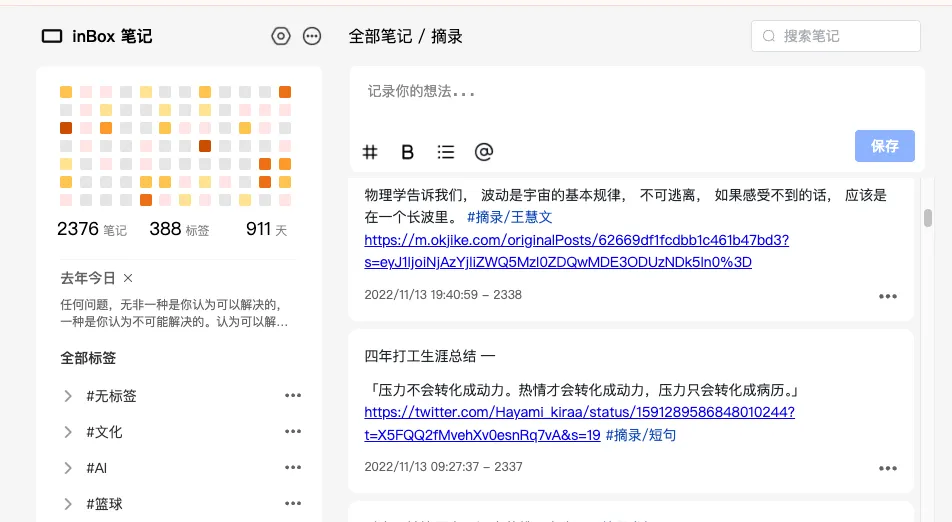
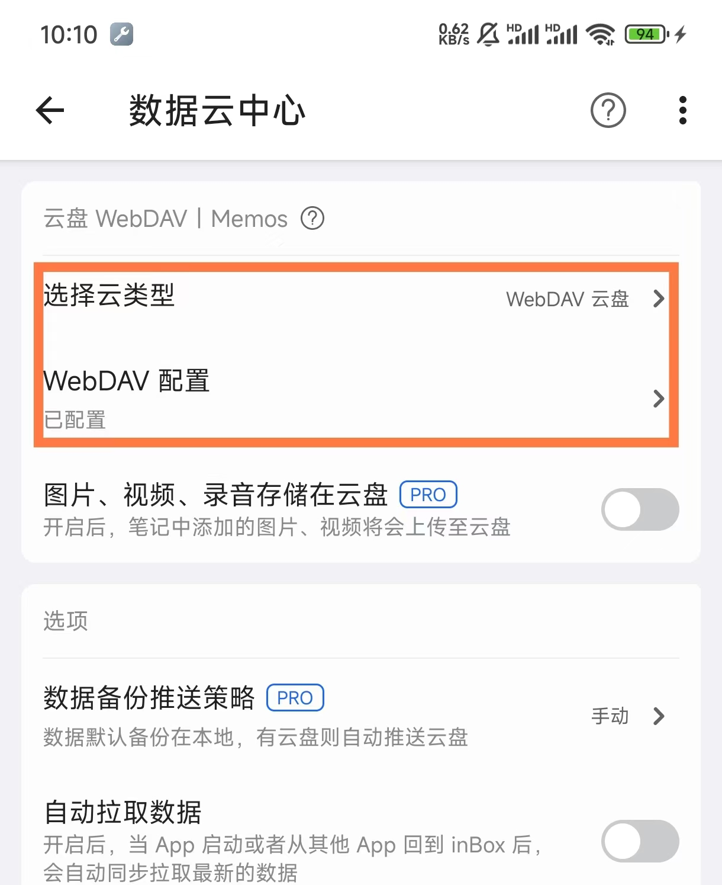
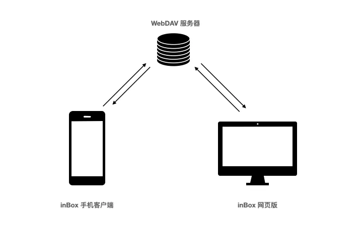
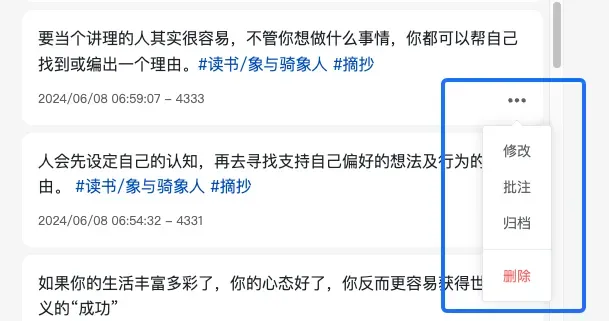
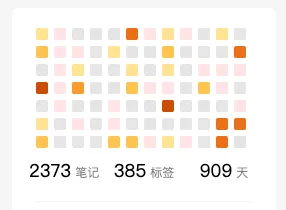
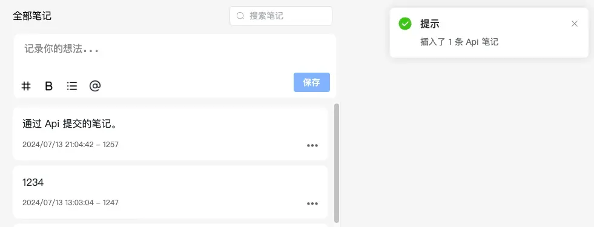
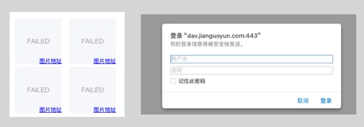

# 介绍

inBox 网页版本的主页样式：

主页地址：**[https://inbox.gudong.site](https://inbox.gudong.site)**

Tip：

> 1、inBox 网页版本还不支持注册，使用时需要在 inBox App 中先完成注册。[去下载](./download.md)

> 2、网页版需要配合个人云盘使用(推荐使用坚果云)，需要在手机数据云中心进行配置。

> 3、使用网页版本需要 inBox 客户端的最低版本 >= 1.7.0  下载地址：[https://www.coolapk.com/apk/292731](https://www.coolapk.com/apk/292731)

下面我详细介绍一下当前的网页版设计。

数据同步
----

网页版跟客户端使用云盘中同一份数据，所以在网页版发布笔记后，在客户端拉取后就可以同步回来，同样的在客户端操作笔记后，在网页版中刷新，数据也会同步回来，双端笔记就会保持一致。

数据双端同步可以自动控制，也可以手动控制，详细可查看 [如何在网页端、客户端同步数据](./data_push.md)

标签
--

使用标签来组织笔记，而非分类，一直是 inBox 的特色之一，网页版本也支持标签体系。跟手机客户端一样，在网页端发布笔记时，会自动解析 # 开头的字符串为标签，比如笔记中包含了 #读书，那么这篇笔记就会跟读书这个标签关系在一起。这里会建立一个当前笔记和标签的关联关系，并且这个关联关系也会同步到手机端去。

左侧菜单栏中，会按照标签父子关系，展示了笔记中所有的标签，不过在网页版本中，对于标签的管理，目前只支持了删除操作和置顶，相比于手机端，这里的删除只删除标签本身，而不会删除标签下的笔记，也不会删除子标签，后面也会考虑把这个机制在手机端也实现一次。

笔记操作

-----------------------------------------------------------------------------------------------------------------------------------------------------------------

主页笔记列表，点击菜单后就可以对笔记进行操作。

*   归档，是把笔记移动到了回收站，回收站可以在侧边菜单顶部的更多按钮中找到。
    
*   删除，操作会把笔记进行删除，并且该操作也会同步删除手机客户端中的笔记，请谨慎操作。
    
*   批注，批注是对笔记的二次补充或者想法的延生，这里会直接在首页的输入框中展示被批注的笔记，然后输入框中继续输入批注信息，即可完成一个批注，批注会是一个新的笔记。
    

热力图
---

热力图用来记录展示自己的笔记情况，很直观的就能展示最近一段时间的记录情况，在网页版中会显示最近三个月的笔记记录情况，点击对应的小格子还可以查看当天的所有笔记。

去年今日
----

笔记记录的久了，回顾之前的笔记就变得更有意义，inBox 网页版中也实现了去年今日，只要记录笔记的时间超过一年，这里就会提示之前记录的笔记，点击那个小叉号 ，可以暂时关闭掉。

Api 💥
------

Api 是 inBox 对外开放的一个能力，任意平台只要支持 inBox 的 Api ，就可以将一段文本同步到 inBox 中。目前 uTools、纸间书摘等都已经支持了 inBox 的 Api，但之前通过 Api 发送笔记后，只能打开 App 才可以看到通过 Api 提交的笔记，本次网页版本中也已经支持了同步 Api 笔记，每次打开网页版执行刷新时，就会将 Api 发送而来的笔记进行同步。

  

Markdown
--------

5 月份时，已经在 inBox 客户端中支持了基础的 Markdown 语法，也支持在 inBox 笔记按照 Markdown 模式去编辑笔记，因此本次在开发网页版本时，在选择编辑器时，就选择了一个开源的 markdown 编辑器：md-editor-v3，这是一个功能丰富的 markdown 编辑器，但考虑到 inBox 的场景，我对其进行了定制，但核心的 markdown 编辑体验还是保留，所以 Markdown 编辑体验其实更好了。

图片
--

目前编辑器还不支持图片上传，后续会进行支持，图床会继续使用 WebDAV。

在网页中，因为 WebDAV 的跨域问题，无法显示 WebDAV 中存储的图片，不过在图片加载失败时，会把 WebDAV 图片地址暴露出来，只需要点击图片，然后在浏览器中打开图片，输入一次 WebDAV 的密码验证信息，浏览器会记住这个凭证，图片就可以正常查看了，如果之前大量使用了 WebDAV 图床，可以用这个方案作为一个折衷方案去使用。

