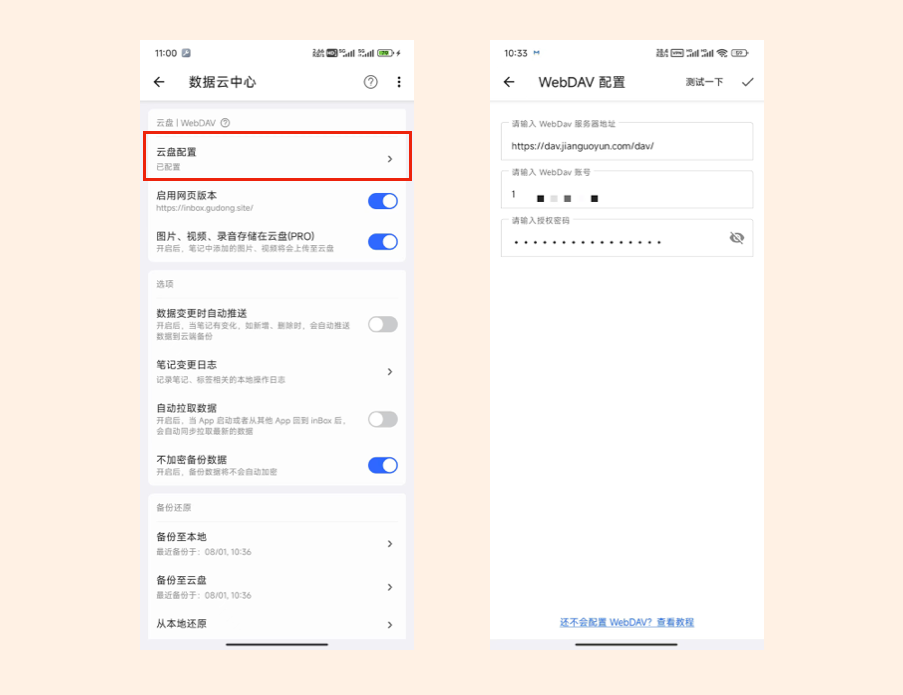

# 数据同步方案
> 方案不合理，高度依赖服务器资源，后续将下线，然后后面会提供 PC 版本


如上所示，是 [inBox 笔记](https://doc.gudong.site/inbox/)客户端与网页版本的数据同步方案，核心是通过 **WebDAV 的方案**。

WebDAV 是目前个人网盘中常用的数据备份同步方案，作为普通用户，只需要注册一个坚果云账号，就可以有一个自己的 WebDAV 网盘，然后在 inBox 手机客户端配置好云盘信息，客户端和网页端就可以使用同一份备份文件，从而达到数据同步的目的。



之前 inBox 用户会有这样的困惑，就是只能在手机上进行笔记记录，而无法在电脑上进行，尽管 inBox 也提供了浏览器插件，但还是要稍显麻烦，并且不支持查看管理所有笔记，所以有了网页版，就可以解决这个问题。


但由于 inBox 是通过三方的 WebDAV 服务器去做同步，手机端、网页端同步数据使用的是一个文件资源，所以最好**同一时间，只有一个端在访问编辑这个数据文件**，否则在一些情况下，就可能出现笔记冲突等问题。这里建议大家在日常使用时，不论哪个端，先刷新一次，再使用。

对于上面这个问题，其实最好的数据同步方案是 **inBox 自建笔记服务器**，这样服务器统一管理用户的笔记数据，同步更彻底，大多数笔记服务商也都是这么做的，但我认为还是将数据的决定权交给用户，数据存储在用户自己的云盘中，对用户而言，数据更加安全可控，隐私性也更好。

但能力越大，责任越大，把笔记数据存储在自己的服务器上，就要承担管理责任，要考虑长期存储问题，以及成本、监管等问题。以上，对于小小的独立开发者而言，有一些沉重，这份沉重一些是物质成本方面，一些是心理方面，笔记数据无小事，笔记存放在那里，就是一份沉甸甸的责任。

综合考虑，还是使用 WebDAV 方案，毕竟大部分情况下还是使用的单端，同时使用双端的情况下很少，这样使用时，只需要多注意一下刷新同步即可。

以上就是关于 inBox 数据同步的一些说明，目前 inBox 的最新版本中已经实现相关的同步机制，只要网盘中的 JSON 备份数据有变化，在打开 inBox 时就会去自动解析下来。

一个想法
----

inBox 实现数据同步后，理论上，任何个人都可以基于 inBox 的备份数据格式（JSON 格式），去开发自己的客户端，你只需要把变化后的数据同步到 WebDAV 服务器即可。

inBox 备份数据格式：

```
{       
    mBlockList:[], //笔记集合       
    mTagList:[], // 标签集合      
    mLinkBlockList:[],//标签 笔记的关联集合       
    mSpConfig:{},//用户偏好设置       
    mCreateTime:1212,//创建时间的时间戳       
    mUpdateTime:1212,//更新时间的时间戳       
    mVersionCode:1212,//客户端版本信息  
}   
```

所以大家如果有人愿意开发 Window、Mac 等版本，欢迎大家折腾，也可以联系我，我可以详细说明一下数据格式，当然现在格式是公开的，自己阅读明白也是完全没有问题的。