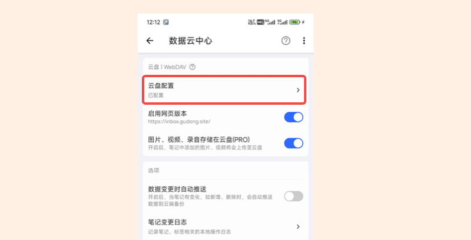

# 云备份

点亮 是一个本地笔记软件，数据均存储在手机本地，为了保证数据安全、点亮 做了很多工作，详情可查看[数据备份](data_backup.md)，但数据只要存储在本地，就有丢失的可能，比如手机坏了，死机了或者丢了。

针对上面的问题，**点亮 支持了个人云盘**，只要在 点亮 中配置好个人云盘，就可以将 点亮 笔记数据同步到个人云端。

目前 点亮 支持的云盘是 WebDAV 云盘。

这里推荐你使用国内的坚果云，免费额度就可以完全满足 点亮 的笔记场景，具体如何操作，可查看教程：[如何配置 WebDAV 云盘](./lesson-webdav.md)

## 相关问题

### 如何把笔记的所有数据，文字、图片等打包转移到另一个手机？
查看 [如何备份还原本地数据](./data_recovery.md)

### 备份、推送，具体是什么操作？
备份时，会生成一份所有笔记、标签等的数据，保存到一个本地文件，作为本地备份。

如果配置了个人云端，会把本地备份文件推送至云端。如果没有配置个人云盘，这里只会进行本地备份。

### 图片、视频、录音怎么备份
这几个数据都是单独的文件，上述备份不会打包这些数据，备份数据中只有图片、视频、录音的具体路径，不会备份这些文件，这些文件都存储在 点亮 的本地目录:
> /storage/emulated/0/Documents/LightPlus

点亮 支持将图片、视频、录音存储在云盘，你可以进行开启，开启后，这样文件将会存储在云端。

### 备份的具体数据有哪些？
1. 笔记数据
2. 标签数据
3. 本地的偏好配置
4. 其他数据，如标签笔记关联表等。

