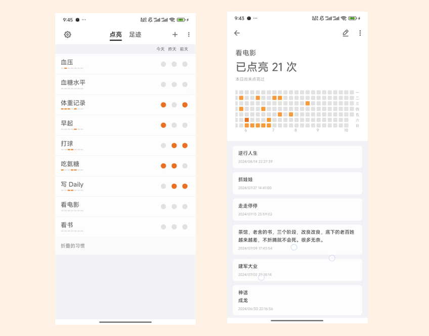

# 点亮

> 点亮习惯，成为更好的自己

点亮是一个简洁实用的习惯打卡软件 它有如下几个特点：

- 简单易用
- 记录热力图
- [积分愿望系统用户指南](./wish.md)
- 灵活的数据导入导出
- 记录打卡日志
- 支持 WebDAV

## 一些其他链接

- [缘起](https://doc.gudong.site/light/why.html)
- [常见问题](https://doc.gudong.site/light/qa.html)
- [联系我们](https://doc.gudong.site/light/contact.html)

##  下载地址
[去下载](../inbox/download.md)