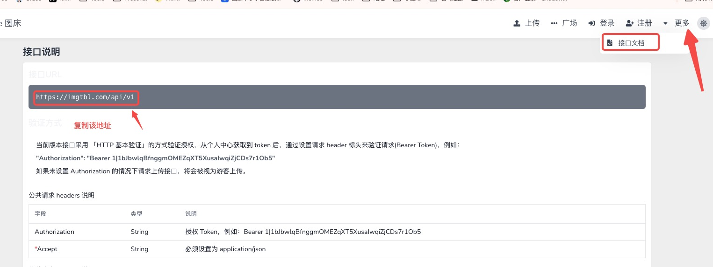
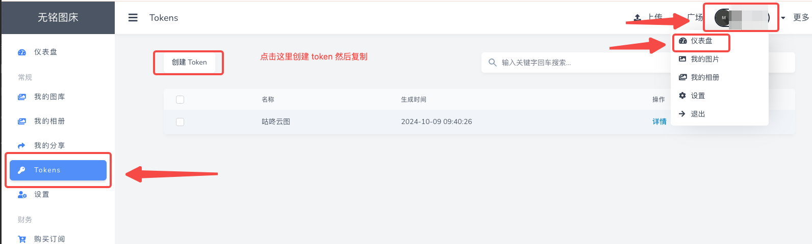

# 配置 Lsky Pro 图床

Lsky Pro 是一个开源的图床框架，主页地址： [https://www.lsky.pro/](https://www.lsky.pro/)

使用该框架，可以在自己服务器快速搭建自己的图床服务，目前已经有不少图床基于 lsky pro 进行开发，这里列举几个公开的 Lsky 图床
- [IMG Table 图床](https://imgtbl.com/)
- [阿段图床](https://img.duan.ee/upload)
- [vrimg 图床](https://vrimg.com/)
更多免费图床见：[免费图床](https://iui.su/pic.html)

Lsky Pro 图床支持通过 API 上传图片，只要在 App 中进行配置，就可以通过手机客户端上传图片到自己的 lsky 图床。

具体配置需要两个参数：
- 接口URL：对应图床的服务器地址
- Tokens：个人信息的凭证，通过该凭证，就可以确定图片上传的目的地

## 如何获取参数
### 获取接口 URL
在对应图床网站注册账号后，点击右上角 \ 接口文档，打开文档主页后，就可以找到，如下图所示：

### 获取 token 
点击个人中心有，选择 token 创建即可，如下所示：

## 其他
- PicPlus 下载地址：[去下载](download.md)
- Lsky-Pro 地址：[https://www.lsky.pro/](https://www.lsky.pro/)

