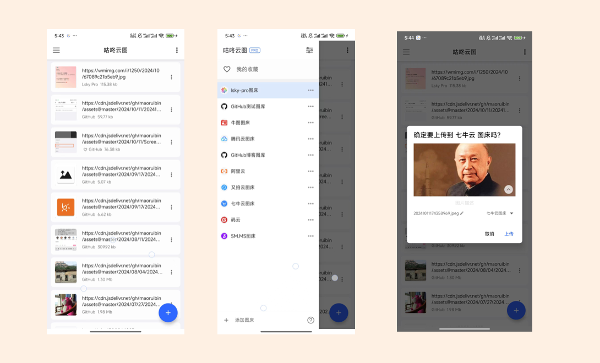

# 咕咚云图

> 手机端的图床工具

咕咚云图 是一个图床上传 APP，可帮你上传手机图片到图床，并生成 markdown 链接，支持七牛云、阿里云等主流图床，同时还支持配置 GitHub、码云为个人图床。

一些功能特性

- 支持 Github、码云为图床
- 支持上传前自动压缩、重命名图片
- 批量上传、删除图片
- 夜间模式（自动设置夜间模式）
- 按分类管理已上传图片
- 支持单图床多份配置
- 自动时间戳重命名图片
- WebDAV. 云备份数据
- 可删除已上传的远程图片
- 自动格式化图片链接为 Markdown、HTML 格式
- 支持通过系统分享上传图片（支持多图）
- 支持自动复制链接
- 支持设置 Markdown 格式的图片标题
- 支持数据导出、导入，自动备份本地数据

更多介绍查看：https://www.yuque.com/gudong-osksb/twgz5k/bfdihv

##  一些其他链接

- [缘起](https://doc.gudong.site/picplus/why.html)
- [常见问题](https://doc.gudong.site/picplus/qa.html)
- [联系我们](https://doc.gudong.site/picplus/contact.html)

##  下载地址

[去下载](download.md)