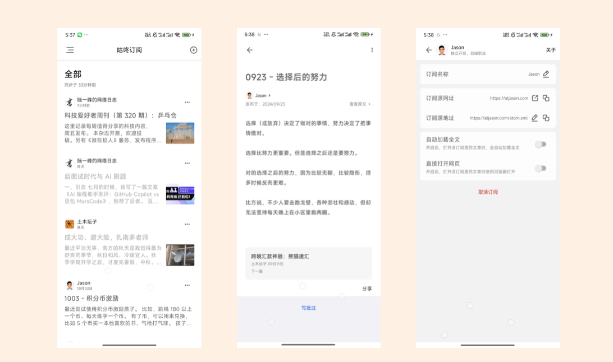

# 咕咚订阅

> 简洁实用的 RSS 订阅软件

它有如下几个特点：

- 聚合式阅读
- 灵活的数据导入导出
- 批注评论订阅的文章
- 备份订阅数据到 WebDAV

##  一些其他链接

- [什么是 RSS](https://doc.gudong.site/rssplus/whatrss.html)
- [缘起(opens new window)](https://gudong.site/2020/11/21/rss.html)
- [常见问题](./qa.md)
- [联系我们](https://doc.gudong.site/inbox/contact.html)

## 下载地址
[去下载](download.md)